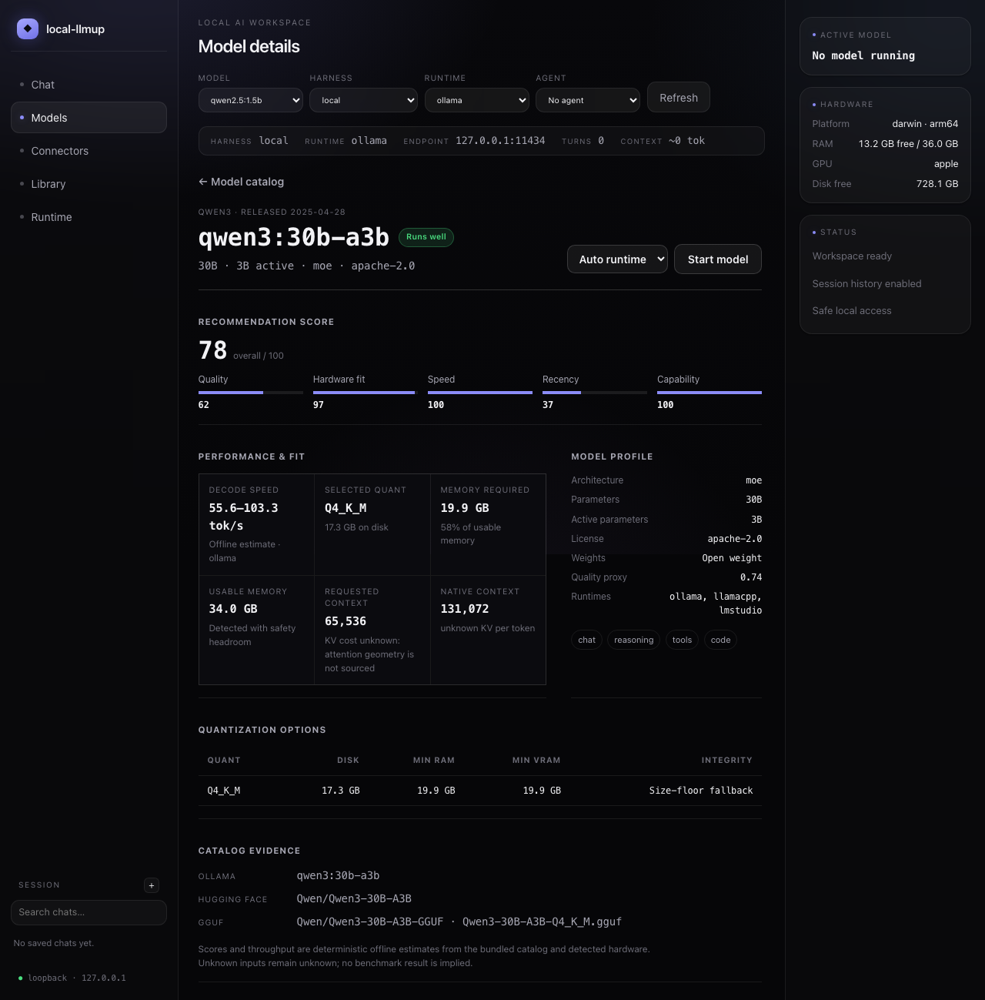
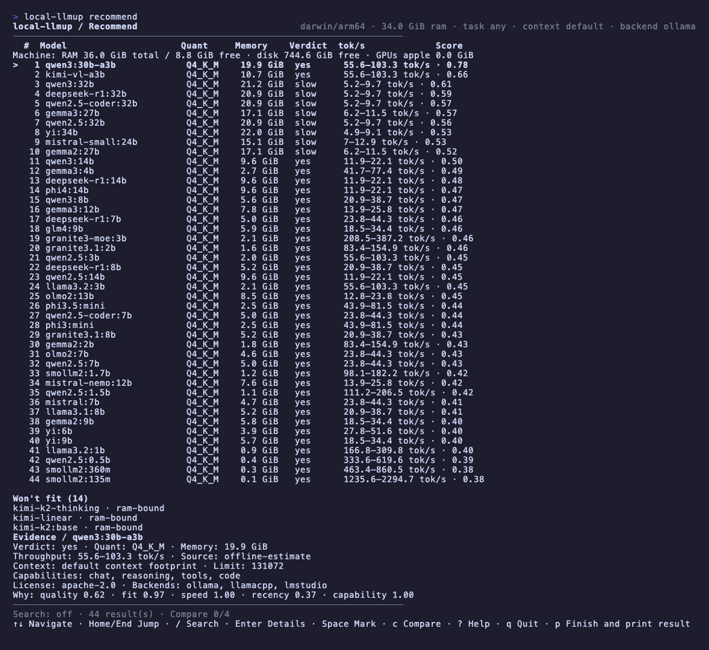
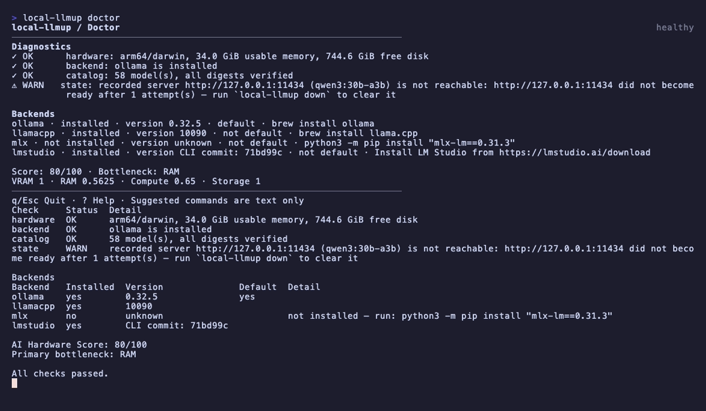
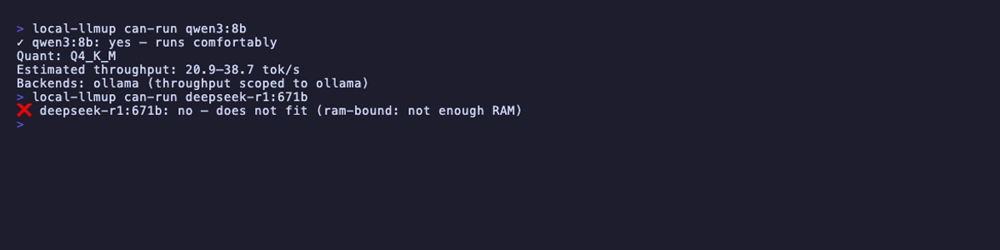
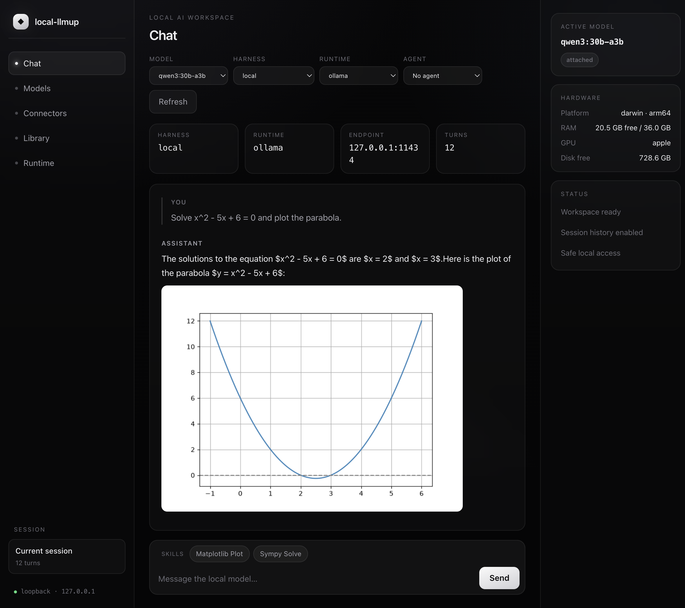
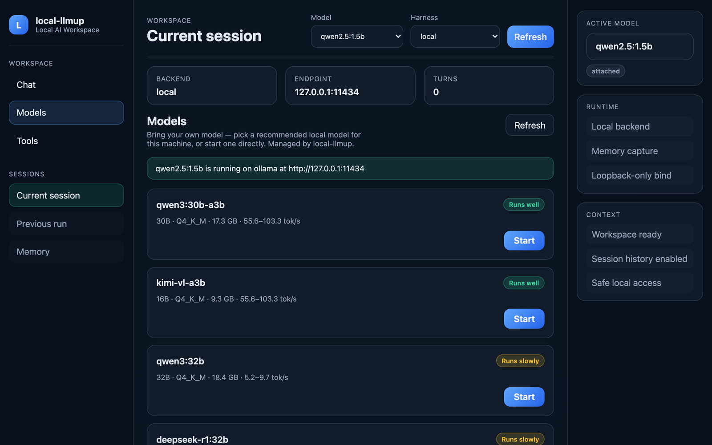
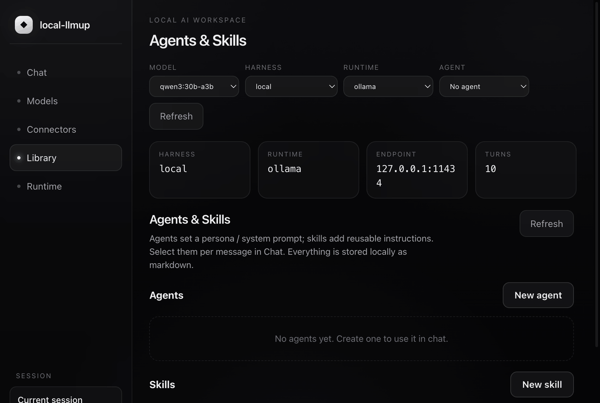
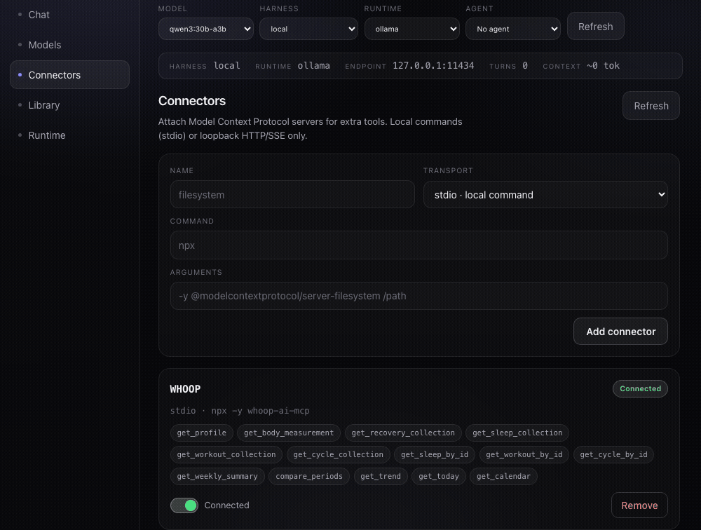
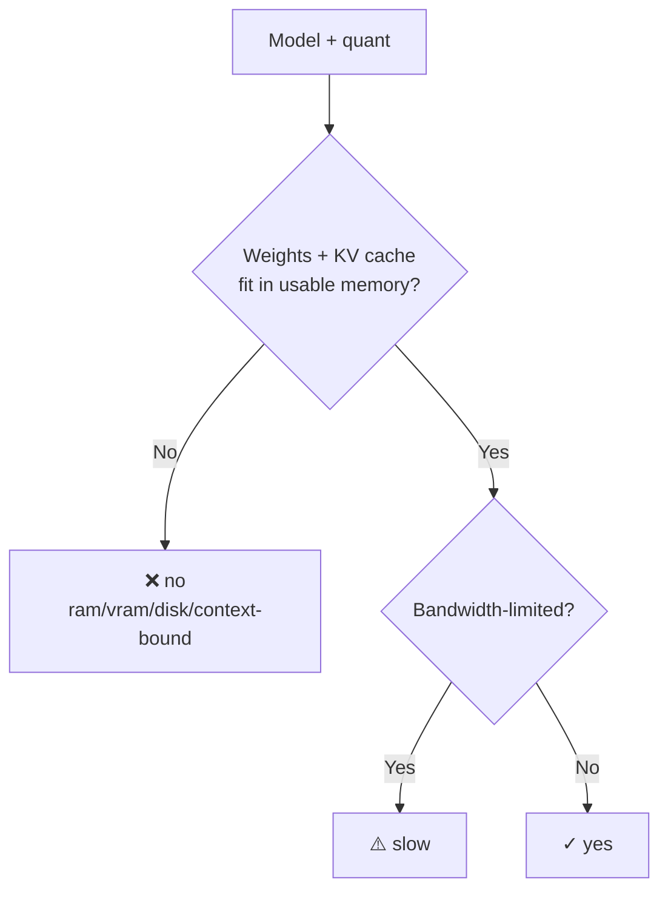
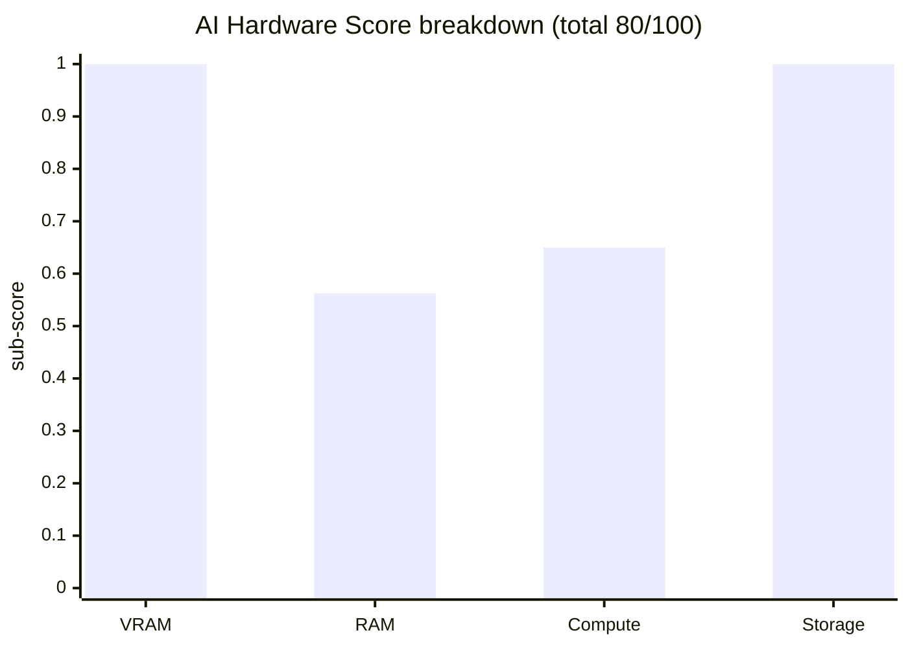

# local-llmup

[](LICENSE)
[](https://nodejs.org)
[](https://www.typescriptlang.org)
[](#development)
[](#supported-backends)

> **Know which local LLMs will actually run on your machine — before you download anything.**

`local-llmup` is a hardware-aware CLI with an interactive terminal UI for
discovering, sizing, installing, serving, and migrating local LLMs. One command
gives you a `yes / slow / no` verdict with estimated tokens-per-second for every
model in its curated catalog — then drives the entire lifecycle from pull through
chat across four supported backends.

<div align="center">

</div>

The model performance view explains every recommendation in one place: composite
and per-dimension scores, estimated throughput with its evidence, required versus
usable memory, context and KV-cache cost, available runtimes, quantizations,
integrity status, capabilities, and catalog sources. Unknown inputs stay
`unknown`; estimates are never presented as measured benchmarks.

---

## Highlights

<div align="center">

</div>

- **Runnability verdicts.** `yes / slow / no` with binding reason and est. tok/s — **before** any download.
- **Interactive TUI.** Rich terminal interface with search, filtering, keyboard navigation, and screen-reader accessible mode. Falls back gracefully to plain text when not in a TTY.
- **Browser GUI.** A loopback-only local AI workspace — pick a recommended model, bring one online, and chat, all managed by `local-llmup`.
- **Agents & skills.** Author reusable agents (personas) and skills, stored locally as markdown; bundle skills into an agent and load them per message.
- **MCP connectors & tools.** Attach Model Context Protocol servers (local stdio or loopback HTTP/SSE) to give the chat real tools, called in an agentic loop.
- **Inline images & graphs.** Let an agent run code in your workspace and render the result — images and graphs display inline in the chat panel.
- **4 backends.** Ollama, llama.cpp, MLX (Apple Silicon), and LM Studio — auto-selected or user-chosen.
- **AI Hardware Score (0–100).** Diagnose your machine's bottleneck in one command.
- **Context-window sizing.** Choose Low, Mid, High, or Max in the GUI (25%, 50%, 75%, or 100% of each model's advertised context), backed by KV-cache-aware memory estimates with GQA-correct attention geometry.
- **Honesty gate.** Unknown figures render as `unknown` — never fabricated.
- **Integrity-verified installs.** SHA-256 digest checks; fail-closed on mismatch.
- **Loopback-only.** Servers bind `127.0.0.1` — nothing exposed to the network.
- **Portable memory.** Chat history follows you between models via `migrate`.
- **Scriptable.** Stable text + `--json`, clean exit codes, zero network for advice.

---

## Table of Contents

- [local-llmup](#local-llmup)
  - [Highlights](#highlights)
  - [Table of Contents](#table-of-contents)
  - [Install](#install)
    - [Docker](#docker)
  - [Quick Start](#quick-start)
  - [Terminal UI](#terminal-ui)
    - [Features](#features)
    - [Keyboard Shortcuts](#keyboard-shortcuts)
    - [Screenshots](#screenshots)
    - [Modes](#modes)
  - [Browser GUI](#browser-gui)
  - [Commands](#commands)
    - [Global Options](#global-options)
    - [Machine-Readable Output](#machine-readable-output)
  - [Supported Backends](#supported-backends)
  - [How Advice Works](#how-advice-works)
  - [Scripting \& Exit Codes](#scripting--exit-codes)
  - [local-llmup vs. Ollama](#local-llmup-vs-ollama)
  - [SOTA Landscape (August 2026)](#sota-landscape-august-2026)
  - [Development](#development)
    - [Architecture](#architecture)
    - [Testing Philosophy](#testing-philosophy)
  - [Troubleshooting](#troubleshooting)
  - [License](#license)

---

## Install

```bash
npm install -g local-llmup
```

Or run without installing:

```bash
npx local-llmup
```

**Requirements:** Node.js 18+ · No API keys · No cloud accounts

### Docker

Pull the multi-platform CLI image from GitHub Container Registry:

```bash
docker pull ghcr.io/shashankswe2020-ux/local-llmup:latest
docker run --rm ghcr.io/shashankswe2020-ux/local-llmup:latest
```

The image is published for `linux/amd64` and `linux/arm64`. Its default command
prints JSON recommendations and advice remains offline. Hardware detection sees
the container's resources, not necessarily the complete host, so use the native
or npm installation for host-accurate recommendations. The browser GUI remains
loopback-only and is not exposed from the container.

For lifecycle commands (`up`, `down`, `chat`, `switch`, `migrate`), you need at
least one backend installed:
- [Ollama](https://ollama.com) (recommended default)
- [llama.cpp](https://github.com/ggml-org/llama.cpp) (`brew install llama.cpp`)
- [MLX](https://github.com/ml-explore/mlx-lm) (`pip install "mlx-lm==0.31.3"`, Apple Silicon only)
- [LM Studio](https://lmstudio.ai) (attach-only, bring your own server)

---

## Quick Start

```bash
# 1. What can this machine run?
local-llmup

# 2. Check a specific model
local-llmup can-run llama3.1:8b

# 3. Pull + verify + serve (loopback-only)
local-llmup up llama3.1:8b

# 4. Chat (records memory)
local-llmup chat

# 5. Migrate memory to a better model
local-llmup migrate --from llama3.1:8b --to qwen3:14b
local-llmup switch qwen3:14b

# 6. Stop when done
local-llmup down
```


---

## Terminal UI

v0.6.0 introduces a full interactive terminal UI that activates automatically
when running in a capable terminal (TTY with ≥60 columns, ≥16 rows).

### Features

| Feature | Description |
|---------|-------------|
| **Interactive model list** | Search, filter, scroll through ranked models with keyboard |
| **Model details & comparison** | Mark models and compare side-by-side |
| **Lifecycle progress** | Real-time pull/verify/serve progress with cancellation |
| **Chat screen** | Multi-line input, streaming responses, session summary |
| **Doctor dashboard** | Box-drawn diagnostics with backend table and score breakdown |
| **Accessible mode** | Cooked line-oriented fallback for screen readers (`--accessible`) |
| **Graceful degradation** | Falls back to plain text in non-TTY / piped / CI environments |

### Keyboard Shortcuts

| Key | Action |
|-----|--------|
| `↑` / `↓` or `j` / `k` | Navigate list |
| `Enter` | Select / confirm |
| `/` | Search / filter |
| `m` | Mark model for comparison |
| `c` | Compare marked models |
| `d` | Show model details |
| `q` / `Esc` | Quit / back |
| `Ctrl+C` | Cancel operation (with compensation) |

### Screenshots

**Recommend** — interactive TUI with ranked models, search, details, and compare:

<div align="center">

</div>

**Doctor** — hardware diagnostics, backend status, and AI hardware score:

<div align="center">

</div>

**Can-run** — instant yes/slow/no verdict for any model:

<div align="center">

</div>

### Modes

The UI auto-selects the best mode for your terminal:

| Mode | When | Behavior |
|------|------|----------|
| **Visual** | TTY ≥60×16 | Full Ink-rendered interactive UI |
| **Accessible** | `--accessible` or `TERM_PROGRAM=screen-reader` | Line-oriented cooked input |
| **Plain** | Non-TTY, piped, `--json`, `--no-tui` | Traditional text output |

---

## Browser GUI

Prefer a point-and-click workflow? `local-llmup gui` launches a local AI
workspace in your browser — a Maka-inspired, local-first interface that reuses
the same `recommend`, `up`, and `ls` internals as the CLI. Bring your own model
by picking a recommended local model for your machine, or start one directly,
then chat with it — no data leaves your machine.

```bash
local-llmup gui                 # serve on 127.0.0.1 and open the browser
local-llmup gui --port 4173     # choose a port
local-llmup gui --no-open       # start the server without opening a browser
```

<div align="center">

</div>

The **Models** view ranks models that fit your hardware with the same
`yes / slow / no` verdicts and estimated tok/s as the CLI, a per-model **runtime
picker** for reaching any backend directly, a **context-window picker**, and a
**Start** button that brings your chosen model online through the verified `up`
lifecycle. Context presets re-rank every model at a percentage of its own
advertised maximum:

| Preset | Model context used | Best for |
|--------|--------------------|----------|
| **Low** | 25% | Lower memory use and shorter conversations |
| **Mid** | 50% | Balanced default |
| **High** | 75% | Longer documents and conversations |
| **Max** | 100% | Full advertised model context when hardware allows |

The model cards show the resulting token count. When sourced attention geometry
is unavailable, the UI reports **context fit unknown** rather than claiming the
KV cache fits. Throughput ranges remain short-context decode estimates because
long-context throughput is not modeled yet.

<div align="center">

</div>

- **Loopback-only.** The server binds `127.0.0.1`, validates the `Host` header,
  and refuses path traversal — nothing is exposed to the network.
- **Managed by local-llmup.** Recommendations, integrity-verified installs, and
  active-server state all flow through the same deterministic engine as the CLI.
- **Pluggable harnesses.** Chat runs against the local backend by default, with
  `claude`, `openai`, and `openai-compatible` harnesses available.

### Agents, skills & tools

Build an **agent** (a persona / system prompt), give it reusable **skills**, and
attach **tools** via MCP connectors — then let it work. Agents and skills are
stored locally as markdown with YAML frontmatter (the Claude Code / Codex
convention); an agent bundles the skills it always loads, and any skill can be
toggled per message. When a connector's tools are available, chat turns run as a
short agentic loop, and generated **images and graphs render inline** in the
panel (served from a validated, loopback-only artifacts endpoint).

<div align="center">

</div>

Attach **Model Context Protocol** servers under **Connectors** — local `stdio`
commands or loopback HTTP/SSE only. Enable a connector and its tools become
available to the model:

<div align="center">

</div>

---

## Commands

| Command | Usage | Purpose |
|---------|-------|---------|
| `recommend` | `local-llmup [--task <t>] [--context <n>] [--json]` | Rank models that fit (default command) |
| `can-run` | `local-llmup can-run <model> [--json]` | `yes/slow/no` for one model |
| `doctor` | `local-llmup doctor [--json]` | Hardware + backend diagnostics |
| `up` | `local-llmup up <model> [--port <p>] [--backend <b>]` | Pull, verify, serve |
| `chat` | `local-llmup chat [-m <model>]` | Interactive chat with memory |
| `gui` | `local-llmup gui [--port <p>] [--harness <h>] [--no-open]` | Launch the browser workspace |
| `ls` | `local-llmup ls` | Show active server |
| `switch` | `local-llmup switch <model>` | Change active model |
| `down` | `local-llmup down [model]` | Stop server |
| `migrate` | `local-llmup migrate --from <a> --to <b> [--dry-run]` | Move memory between models |
| `catalog` | `local-llmup catalog [--all] [--refresh]` | Browse model catalog |

### Global Options

```
--task <task>         Boost models for: chat|code|vision|reasoning|tools|embedding
--context <tokens>    Size KV cache at N tokens and re-rank
--max-context         Report largest holdable context per model
--backend <name>      Scope to: ollama|llamacpp|mlx|lmstudio
--available-backends  Only show models an installed backend can serve
--json                Machine-readable JSON output
--no-tui              Force plain text mode
--accessible          Force accessible mode
-h, --help            Help
-v, --version         Version
```

### Machine-Readable Output

```json
{
  "hardware": { "arch": "arm64", "platform": "darwin", "usableBytes": 36507222016 },
  "ranked": [
    {
      "rank": 1,
      "id": "qwen3:30b-a3b",
      "params": "30B",
      "quant": "Q4_K_M",
      "verdict": "yes",
      "score": 0.78,
      "throughput": { "known": true, "lowTokPerSec": 55.6, "highTokPerSec": 103.3 },
      "backends": ["ollama", "llamacpp", "lmstudio"]
    }
  ],
  "wontFit": [{ "id": "llama3.1:70b", "reason": "ram-bound" }]
}
```

---

## Supported Backends

| Backend | Platform | Lifecycle | Notes |
|---------|----------|-----------|-------|
| **Ollama** | All | Full (pull/serve/stop) | Default. Managed daemon. |
| **llama.cpp** | All | Full (pull/serve/stop) | Self-managed GGUF with HF acquisition |
| **MLX** | macOS (Apple Silicon) | Full (pull/serve/stop) | `mlx-lm` Python package |
| **LM Studio** | All | Attach-only | User manages the server; llmup attaches |

**Auto-selection logic:**
- Apple Silicon → MLX preferred (when installed)
- Everywhere else → Ollama preferred (when installed)
- Override with `--backend <name>`

All backends bind to `127.0.0.1` only. Integrity verification is SHA-256 for
self-managed pulls; LM Studio uses delegated integrity with a named trust boundary.

---

## How Advice Works



| Principle | Implementation |
|-----------|---------------|
| **Offline** | Zero network calls. Curated dataset in `data/` |
| **Deterministic** | Same hardware → same output, always |
| **Memory-bandwidth model** | tok/s from hardware bandwidth × model size |
| **KV-cache aware** | `--context N` includes fp16 KV (GQA-correct geometry) |
| **Honest** | Unknown → `unknown`, never fabricated |

**AI Hardware Score** is a blend of VRAM, RAM, compute, and storage sub-scores
(each 0–1). The lowest sub-score is surfaced as your bottleneck:



---

## Scripting & Exit Codes

| Command | Exit 0 | Exit 1 |
|---------|--------|--------|
| `can-run` | `yes` or `slow` | `no` |
| `doctor` | All checks pass | Any check fails |
| `recommend` | Success | Invalid input |
| `up` | Model served | Verification/pull failed |

```bash
# CI gate example
if local-llmup can-run llama3.1:8b; then
  local-llmup up llama3.1:8b
fi
```

---

## local-llmup vs. Ollama

| Feature | Ollama | local-llmup |
|---------|--------|-------------|
| Run inference | ✅ | ✅ (via backends) |
| Hardware-aware recommendations | ❌ | ✅ |
| Quantization selection | ❌ | ✅ |
| Multi-backend (4 runtimes) | ❌ | ✅ |
| Integrity-verified pulls (SHA-256) | ❌ | ✅ |
| Context-window sizing | ❌ | ✅ |
| Memory migration between models | ❌ | ✅ |
| Interactive TUI | ❌ | ✅ |
| AI Hardware Score | ❌ | ✅ |
| Accessible mode (screen readers) | ❌ | ✅ |

> **Homebrew for local LLMs** — hardware-aware model selection with a consistent
> workflow across runtimes.

---

## SOTA Landscape (August 2026)

This snapshot compares `local-llmup` with the leading local inference and
workspace tools as of **2026-08-30**. It is a capability map, not a benchmark
ranking; runtimes and model support change quickly.

| Project | Best at | How `local-llmup` complements it |
|---------|----------|----------------------------------|
| [Ollama](https://ollama.com) | Simple model pull, local serving, and an OpenAI-compatible API | Adds hardware-fit verdicts, throughput estimates, integrity checks, and lifecycle portability |
| [llama.cpp](https://github.com/ggerganov/llama.cpp) | Portable, dependency-light inference across CPU/GPU backends and quantizations | Adds model selection before download and a consistent orchestration layer |
| [MLX-LM](https://github.com/ml-explore/mlx-lm) | Apple Silicon generation, quantization, and fine-tuning | Adds cross-platform recommendations and backend selection |
| [LM Studio](https://lmstudio.ai) | GUI-first model discovery, chat, and local API serving | Adds deterministic CLI/TUI workflows, scriptable output, and memory migration |
| [vLLM](https://github.com/vllm-project/vllm) | High-throughput, concurrent GPU serving with batching and distributed execution | Targets the single-user, hardware-constrained local workflow and can-run decisions |
| [LocalAI](https://github.com/mudler/LocalAI) | OpenAI-compatible multi-backend server for LLM, vision, voice, and image workloads | Adds catalog-backed hardware sizing and verified model lifecycle operations |
| [AnythingLLM](https://github.com/Mintplex-Labs/anything-llm) | Document workspaces, agents, and multi-user knowledge workflows | Adds runtime-aware model recommendations underneath the workspace layer |

**Positioning:** the major tools above optimize inference, serving, or
application UX. `local-llmup` is the decision and lifecycle layer between a
machine and those runtimes: measure the hardware, explain what fits, choose a
backend, verify the weights, then serve and migrate without guessing.

---

## Development

```bash
npm install          # Install dependencies
npm run build        # Compile TypeScript
npm test             # 1459 tests (Vitest)
npm run typecheck    # tsc --noEmit
npm run lint         # ESLint
npm run format       # Prettier
npm run dev          # Dev mode (tsx src/cli.ts)
npm run bootstrap    # Regenerate data/models.json
```

### Architecture

```
src/
├── cli.ts, bin.ts       Entry points & CLI wiring
├── commands/            One file per subcommand
├── advisor/             Scoring, throughput, verdict engine
├── hardware/            Detection + memory math (KV-cache sizing)
├── catalog/             Model catalog, schema, enrichment
├── backend/             Ollama, llama.cpp, MLX, LM Studio adapters
├── ranking/             Fit + rank + weights
├── memory/              Conversation memory capture & migration
├── state/               Active-model / server state
└── tui/                 Terminal UI (Ink 5 + React 18)
    ├── screens/         Visual components (recommend, chat, lifecycle, doctor)
    ├── session.ts       Terminal resource ownership & restoration
    ├── capabilities.ts  Mode selection (visual/accessible/plain)
    ├── cancellation.ts  Signal handling + compensation
    ├── chat-limits.ts   Draft validation & session summary
    └── keys.ts          Keyboard binding definitions
```

### Testing Philosophy

- **TDD.** Failing test → minimal implementation → refactor.
- **All mocked.** No real network/Ollama/filesystem in Vitest tests.
- **87 test files, 1459 assertions.** Unit > integration > e2e.
- **Coverage gates.** 80% lines+branches on core modules.
- **Runtime smoke.** Real backend processes tested separately via production builds.

---

## Troubleshooting

| Problem | Solution |
|---------|----------|
| `up` fails with size mismatch | Re-run — likely an interrupted download |
| `ollama is not installed` | Install from [ollama.com](https://ollama.com); advice commands still work |
| Throughput shows `unknown` | Your hardware bandwidth isn't in the dataset |
| TUI not rendering | Check terminal size ≥60×16, or use `--no-tui` |
| Screen reader not working | Use `--accessible` flag |
| KV Cache shows `unknown` | Model's attention geometry isn't in the dataset |

---

## License

[MIT](LICENSE)
