# local-llmup — which local LLMs can your computer run?

[](https://github.com/shashankswe2020-ux/local-llmup/actions/workflows/ci.yml)
[](https://crates.io/crates/llmup-cli)
[](https://crates.io/crates/llmup-cli)
[](LICENSE)
[](https://www.rust-lang.org)
[](#supported-backends)

> **Know which local LLMs will actually run on your machine — before you download anything.**

`local-llmup` is a hardware-aware local LLM checker and launcher: a fast native
Rust CLI, terminal UI and browser GUI that reads your GPU VRAM, unified memory,
RAM and disk, then gives every model in its curated catalog a `yes / slow / no`
verdict with an estimated tokens-per-second range. Think of it as a VRAM
calculator that can also act on the answer — it picks a quantization, pulls and
SHA-256-verifies the weights, serves them on `127.0.0.1`, and lets you chat,
switch and migrate memory across [Ollama](https://ollama.com),
[llama.cpp](https://github.com/ggml-org/llama.cpp),
[MLX](https://github.com/ml-explore/mlx-lm) and [LM Studio](https://lmstudio.ai).
It runs on macOS (Apple Silicon and Intel), Linux and Windows, with NVIDIA, AMD,
Intel and Apple GPUs or CPU only.

<div align="center">
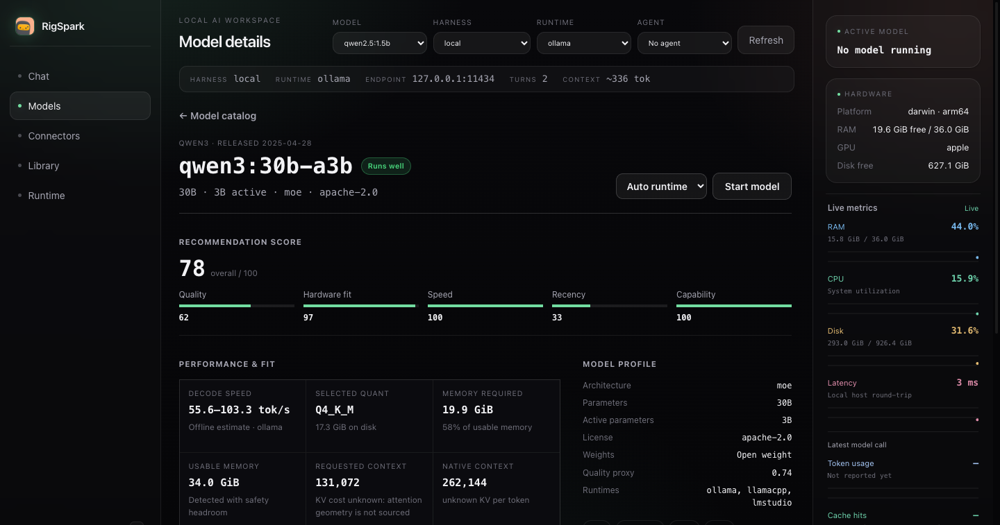
</div>

The model performance view explains every recommendation in one place: composite
and per-dimension scores, estimated throughput with its evidence, required versus
usable memory, context and KV-cache cost, available runtimes, quantizations,
integrity status, capabilities, and catalog sources. Unknown inputs stay
`unknown`; estimates are never presented as measured benchmarks.

---

## Highlights

<div align="center">

</div>

- **Runnability verdicts.** `yes / slow / no` with binding reason and est. tok/s — **before** any download.
- **Interactive TUI.** Rich terminal interface with search, filtering, keyboard navigation, and screen-reader accessible mode. Falls back gracefully to plain text when not in a TTY.
- **Browser GUI.** A loopback-only local AI workspace — pick a recommended model, bring one online, and chat, all managed by `local-llmup`.
- **Agents & skills.** Author reusable agents (personas) and skills, stored locally as markdown; bundle skills into an agent and load them per message.
- **MCP connectors & tools.** Attach Model Context Protocol servers (local stdio or loopback HTTP/SSE) to give the chat real tools, called in an agentic loop.
- **Inline images & graphs.** Let an agent run code in your workspace and render the result — images and graphs display inline in the chat panel.
- **4 backends.** Ollama, llama.cpp, MLX (Apple Silicon), and LM Studio — auto-selected or user-chosen.
- **AI Hardware Score (0–100).** Diagnose your machine's bottleneck in one command.
- **Context-window sizing.** Choose Low, Mid, High, or Max in the GUI (25%, 50%, 75%, or 100% of each model's advertised context), backed by KV-cache-aware memory estimates with GQA-correct attention geometry.
- **Honesty gate.** Unknown figures render as `unknown` — never fabricated.
- **Integrity-verified installs.** SHA-256 digest checks; fail-closed on mismatch.
- **Loopback-only.** Servers bind `127.0.0.1` — nothing exposed to the network.
- **Portable memory.** Chat history follows you between models via `migrate`.
- **Scriptable.** Stable text + `--json`, clean exit codes, zero network for advice.

---

## Table of Contents

- [local-llmup](#local-llmup)
  - [Highlights](#highlights)
  - [Table of Contents](#table-of-contents)
  - [Install](#install)
    - [Docker](#docker)
  - [Performance (1.0 native vs. 0.11.4 Node)](#performance-10-native-vs-0114-node)
  - [Quick Start](#quick-start)
  - [Model Catalog](#model-catalog)
    - [Catalog Enrichment](#catalog-enrichment)
  - [Terminal UI](#terminal-ui)
    - [Features](#features)
    - [Keyboard Shortcuts](#keyboard-shortcuts)
    - [Screenshots](#screenshots)
    - [Modes](#modes)
  - [Browser GUI](#browser-gui)
  - [Commands](#commands)
    - [Global Options](#global-options)
    - [Machine-Readable Output](#machine-readable-output)
  - [Supported Backends](#supported-backends)
  - [How Advice Works](#how-advice-works)
  - [Scripting \& Exit Codes](#scripting--exit-codes)
  - [local-llmup vs. Ollama](#local-llmup-vs-ollama)
  - [SOTA Landscape (August 2026)](#sota-landscape-august-2026)
  - [FAQ](#faq)
  - [Development](#development)
    - [Architecture](#architecture)
    - [Testing Philosophy](#testing-philosophy)
  - [Troubleshooting](#troubleshooting)
  - [License](#license)

---

## Install

`local-llmup` is a native Rust application. Every install puts the `llmup` and
`local-llmup` aliases next to the `llmup-gui` companion that `llmup gui`
launches; the binaries need no Node.js, Python or compiler at runtime.

**Homebrew** (macOS and Linux):

```bash
brew install shashankswe2020-ux/tap/local-llmup
```

**Prebuilt archives** for macOS (Apple Silicon, Intel), Linux (x64, ARM64) and
Windows (x64) are attached to every
[GitHub release](https://github.com/shashankswe2020-ux/local-llmup/releases/latest)
with a `SHA256SUMS` file. Unpack one and put the folder on your `PATH`. Archives
are unsigned; on macOS run `xattr -dr com.apple.quarantine local-llmup-*` after
unpacking.

**Cargo** — prebuilt with [cargo-binstall](https://github.com/cargo-bins/cargo-binstall),
or from source with Rust 1.98 or newer ([rustup](https://rustup.rs)):

```bash
cargo binstall llmup-cli llmup-gui
cargo install llmup-cli --locked --bin llmup --bin local-llmup
cargo install llmup-gui --locked
```

Install both crates into the same Cargo `bin` directory (the default) so the CLI
can find the GUI beside it.

From a checkout, use the same pinned toolchain:

```bash
cargo install --locked --path crates/llmup-cli --bin llmup --bin local-llmup
cargo install --locked --path crates/llmup-gui
cargo llmup          # or run without installing
```

**Upgrading from the npm package (0.x).** The Node.js package is retired and
receives no further releases. Remove it with `npm uninstall -g local-llmup`, then
install with Cargo as above. Commands, flags, `--json` output and the
`~/.local-llmup` state directory are unchanged, so active servers and chat memory
carry over. Signed archives and desktop installers are not released yet.

### Docker

Historical multi-platform CLI images remain available from GitHub Container Registry:

```bash
docker pull ghcr.io/shashankswe2020-ux/local-llmup:latest
docker run --rm ghcr.io/shashankswe2020-ux/local-llmup:latest
```

Those images target `linux/amd64` and `linux/arm64` and predate the native
release. The current Dockerfile builds the native binaries; a native image has not
been published yet. Its default command
prints JSON recommendations and advice remains offline. Hardware detection sees
the container's resources, not necessarily the complete host, so use the native
installation for host-accurate recommendations. The browser GUI remains
loopback-only and is not exposed from the container.

For lifecycle commands (`up`, `down`, `chat`, `switch`, `migrate`), you need at
least one backend installed:
- [Ollama](https://ollama.com) (recommended default)
- [llama.cpp](https://github.com/ggml-org/llama.cpp) (`brew install llama.cpp`)
- [MLX](https://github.com/ml-explore/mlx-lm) (`pip install "mlx-lm==0.31.3"`, Apple Silicon only)
- [LM Studio](https://lmstudio.ai) (attach-only, bring your own server)

---

## Performance (1.0 native vs. 0.11.4 Node)

Measured on an Apple M4 Max (36 GB, macOS 26.5) against the published
`local-llmup@0.11.4` running on Node.js 26: medians of 30 interleaved runs,
peak RSS from `/usr/bin/time -l`, isolated state directories. Advice output
(`recommend` and `can-run` JSON) was byte-for-byte equivalent after key ordering.

| Command | 0.11.4 (Node) | 1.0 (native) | Speedup | Peak RSS (Node → native) |
|---------|---------------|--------------|---------|--------------------------|
| `--version` | 139.6 ms | 5.8 ms | 23.9× | 68.1 → 8.1 MiB |
| `recommend --json` | 548.7 ms | 326.8 ms | 1.7× | 72.3 → 15.0 MiB |
| `recommend --max-context --json` | 508.9 ms | 375.6 ms | 1.4× | 72.0 → 15.0 MiB |
| `can-run qwen3:8b --json` | 550.8 ms | 333.3 ms | 1.7× | 71.8 → 15.0 MiB |
| `doctor --json` | 849.9 ms | 691.0 ms | 1.2× | backend probes dominate |

Advice itself takes about 19 ms; roughly 300 ms of each advice command is the
operating system's GPU query (`system_profiler` on macOS), which both versions
perform. Install size drops from 51 MB of `node_modules` plus a Node runtime to a
single 12.6 MB `llmup` binary. Results vary by machine and runtime version.

---

## Quick Start

```bash
# 1. What can this machine run?
local-llmup

# 2. Check a specific model
local-llmup can-run llama3.1:8b

# 3. Pull + verify + serve (loopback-only)
local-llmup up llama3.1:8b

# 4. Chat (records memory)
local-llmup chat

# 5. Migrate memory to a better model
local-llmup migrate --from llama3.1:8b --to qwen3:14b
local-llmup switch qwen3:14b

# 6. Stop when done
local-llmup down
```

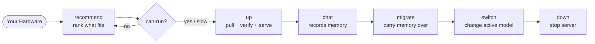
```mermaid
flowchart LR
    HW([Your Hardware]) --> REC["recommend<br/>rank what fits"]
    REC --> CR{"can-run?"}
    CR -- "yes / slow" --> UP["up<br/>pull + verify + serve"]
    CR -- "no" --> REC
    UP --> CHAT["chat<br/>records memory"]
    CHAT --> MIG["migrate<br/>carry memory over"]
    MIG --> SW["switch<br/>change active model"]
    SW --> DOWN["down<br/>stop server"]
```

---

## Model Catalog

`local-llmup` ships a deterministic, offline catalog of 66 curated model
variants. Each record connects model identity and capabilities to the evidence
the advisor needs: parameter count, architecture, license, context ceiling,
quantizations, artifact size, source coordinates, and integrity digest. Run
`local-llmup catalog --all` to browse it or open a model in the browser GUI for
its complete performance and fit breakdown.

Catalog metadata is deliberately conservative. A model with unknown attention
geometry remains eligible for weight-based ranking, but its KV-cache cost and
maximum safe context are reported as `unknown` rather than inferred from a
different architecture.

### Catalog Enrichment

The catalog pipeline separates human-reviewed facts from machine-verifiable
artifact metadata:

1. **Curate.** Maintainers add architecture, license, capabilities, context,
  quantization, and official source IDs to
  `crates/llmup-core/fixtures/registry-snapshot.json`.
2. **Bootstrap.** `cargo catalog-bootstrap` deterministically generates
  `crates/llmup-core/data/models.json` from that pinned snapshot.
3. **Enrich.** `cargo catalog-enrich` resolves already-curated Ollama sources
  and pins exact model-layer bytes and SHA-256 digests. It never invents or
  changes curated architecture facts.
4. **Audit.** The weekly Catalog Freshness workflow checks snapshot drift and
  compares represented repositories with Ollama's local-library inventory.
  Missing repositories update one review issue instead of entering the catalog
  automatically.

Repository coverage is a discovery signal, not an admission mechanism. Ollama
does not expose a public tag-enumeration endpoint, so the audit cannot identify
missing variants inside a repository that is already represented. Every
candidate still requires source and metadata review.

```bash
cargo catalog-bootstrap    # regenerate from the curated snapshot (requires Rust)
cargo catalog-refresh --dry-run  # preview snapshot drift without writes
cargo catalog-enrich      # pin exact bytes and digests for known sources
cargo catalog-coverage    # report missing upstream repositories (requires Rust)
cargo catalog-freshness   # report age and snapshot drift (Rust toolchain required)
```

The workflow formats its PR/issue bodies using `cargo catalog-notice <kind>
--input <report.json>`. This command only validates and reads the report; it does
not contact GitHub or modify files. All catalog maintenance commands are native.

`cargo catalog-enrich --dry-run` checks live manifests without writing the catalog.
For offline verification, add `--manifest-fixture <file.json>`: the file maps exact
registry manifest URLs to `{ "status": 200, "body": <manifest> }` responses.
Unrecorded URLs behave as unavailable models and never cause a live fallback.
Use `--catalog-path <file>` for an isolated catalog and `--now <RFC3339 timestamp>`
for reproducible output. No-op and failed-lookups-only runs preserve source bytes;
changed catalogs are schema-validated and written atomically.

---

## Terminal UI

The interactive terminal UI activates automatically when running in a capable
terminal (TTY with ≥60 columns, ≥16 rows).

### Features

| Feature | Description |
|---------|-------------|
| **Interactive model list** | Search, filter, scroll through ranked models with keyboard |
| **Model details & comparison** | Mark models and compare side-by-side |
| **Lifecycle progress** | Real-time pull/verify/serve progress with cancellation |
| **Chat screen** | Multi-line input, streaming responses, session summary |
| **Doctor dashboard** | Box-drawn diagnostics with backend table and score breakdown |
| **Accessible mode** | Cooked line-oriented fallback for screen readers (`--accessible`) |
| **Graceful degradation** | Falls back to plain text in non-TTY / piped / CI environments |

### Keyboard Shortcuts

| Key | Action |
|-----|--------|
| `↑` / `↓` or `j` / `k` | Navigate list |
| `PgUp` / `PgDn`, `Home` / `End` | Jump by page or to either end |
| `Enter` / `→` / `Tab` | Open model details |
| `Esc` / `←` / `Backspace` | Back (quits from the list) |
| `/` | Search / filter (`Ctrl+U` resets the filter) |
| `Space` | Mark model for comparison (up to 4) |
| `c` | Compare 2–4 marked models |
| `i` | Machine and scope overview |
| `p` | Finish and print the top pick's command (never executes it) |
| `?` | Keyboard help |
| `q` | Quit |
| `Ctrl+C` | Interrupt (exit 130) |

### Screenshots

**Recommend** — interactive TUI with ranked models, search, details, and compare:

<div align="center">
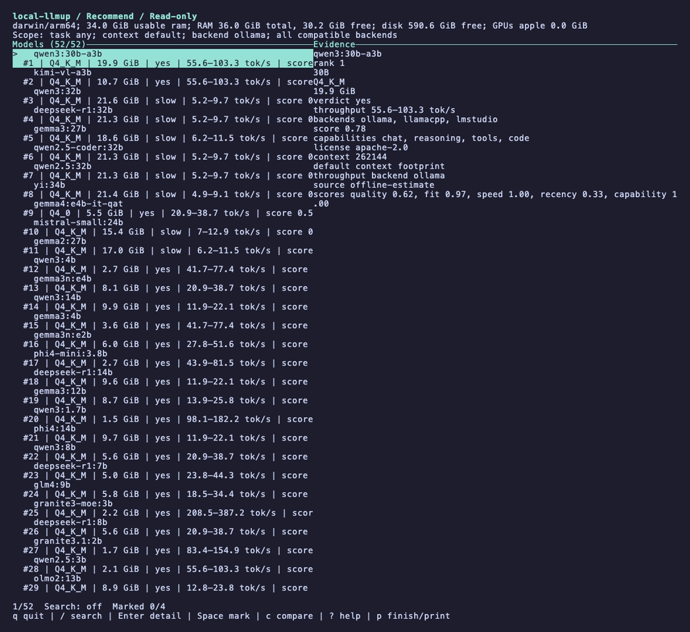
</div>

**Doctor** — hardware diagnostics, backend status, and AI hardware score:

<div align="center">
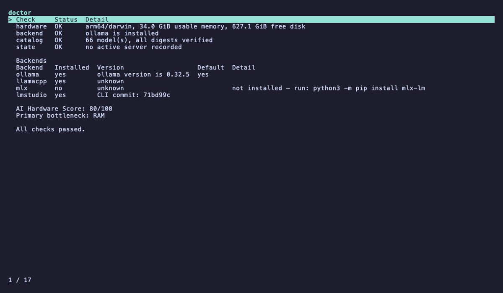
</div>

**Can-run** — instant yes/slow/no verdict for any model:

<div align="center">
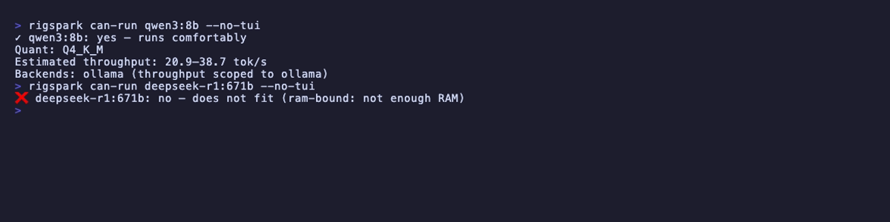
</div>

### Modes

The UI auto-selects the best mode for your terminal:

| Mode | When | Behavior |
|------|------|----------|
| **Visual** | TTY ≥60×16 | Full-screen native interactive UI |
| **Accessible** | `--accessible` or `TERM_PROGRAM=screen-reader` | Line-oriented cooked input |
| **Plain** | Non-TTY, piped, `--json`, `--no-tui` | Traditional text output |

---

## Browser GUI

Prefer a point-and-click workflow? `local-llmup gui` launches a local AI
workspace in your browser — a Maka-inspired, local-first interface that reuses
the same `recommend`, `up`, and `ls` internals as the CLI. Bring your own model
by picking a recommended local model for your machine, or start one directly,
then chat with it — no data leaves your machine.

```bash
local-llmup gui                 # serve on 127.0.0.1 and open the browser
local-llmup gui --port 4173     # choose a port
local-llmup gui --no-open       # start the server without opening a browser
```

<div align="center">
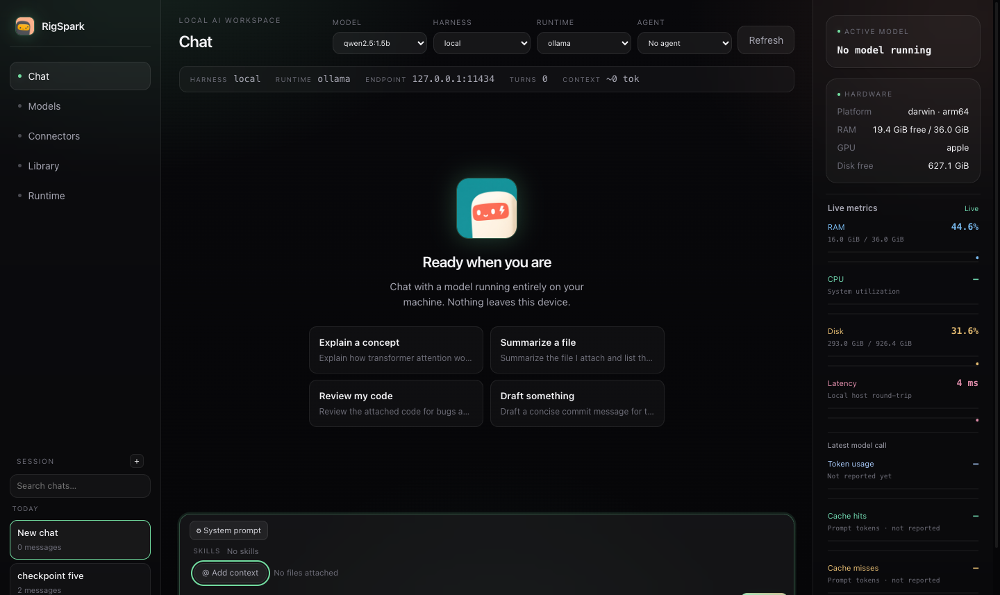
</div>

The **Models** view ranks models that fit your hardware with the same
`yes / slow / no` verdicts and estimated tok/s as the CLI, a per-model **runtime
picker** for reaching any backend directly, a **context-window picker**, and a
**Start** button that brings your chosen model online through the verified `up`
lifecycle. Context presets re-rank every model at a percentage of its own
advertised maximum:

| Preset | Model context used | Best for |
|--------|--------------------|----------|
| **Low** | 25% | Lower memory use and shorter conversations |
| **Mid** | 50% | Balanced default |
| **High** | 75% | Longer documents and conversations |
| **Max** | 100% | Full advertised model context when hardware allows |

The model cards show the resulting token count. When sourced attention geometry
is unavailable, the UI reports **context fit unknown** rather than claiming the
KV cache fits. Throughput ranges remain short-context decode estimates because
long-context throughput is not modeled yet.

<div align="center">
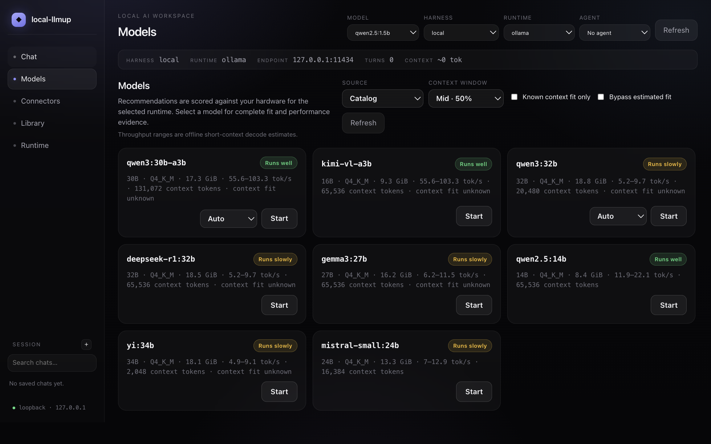
</div>

- **Loopback-only.** The server binds `127.0.0.1`, validates the `Host` header,
  and refuses path traversal — nothing is exposed to the network.
- **Managed by local-llmup.** Recommendations, integrity-verified installs, and
  active-server state all flow through the same deterministic engine as the CLI.
- **Pluggable harnesses.** Chat runs against the local backend by default, with
  `claude`, `openai`, `openai-compatible`, and `opencode` harnesses available.
  The `opencode` harness drives the OpenCode CLI in JSON mode and surfaces its
  tool loop (bash, write, read) inline in the chat panel.

### Agents, skills & tools

Build an **agent** (a persona / system prompt), give it reusable **skills**, and
attach **tools** via MCP connectors — then let it work. Agents and skills are
stored locally as markdown with YAML frontmatter (the Claude Code / Codex
convention); an agent bundles the skills it always loads, and any skill can be
toggled per message. When a connector's tools are available, chat turns run as a
short agentic loop, and generated **images and graphs render inline** in the
panel (served from a validated, loopback-only artifacts endpoint).

<div align="center">
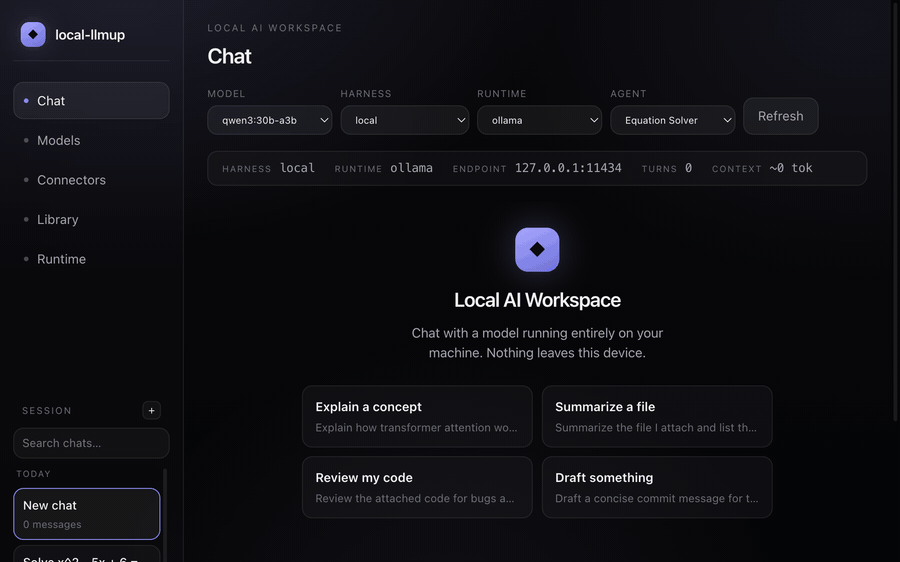
</div>

Attach **Model Context Protocol** servers under **Connectors** — local `stdio`
commands or loopback HTTP/SSE only. Enable a connector and its tools become
available to the model:

<div align="center">
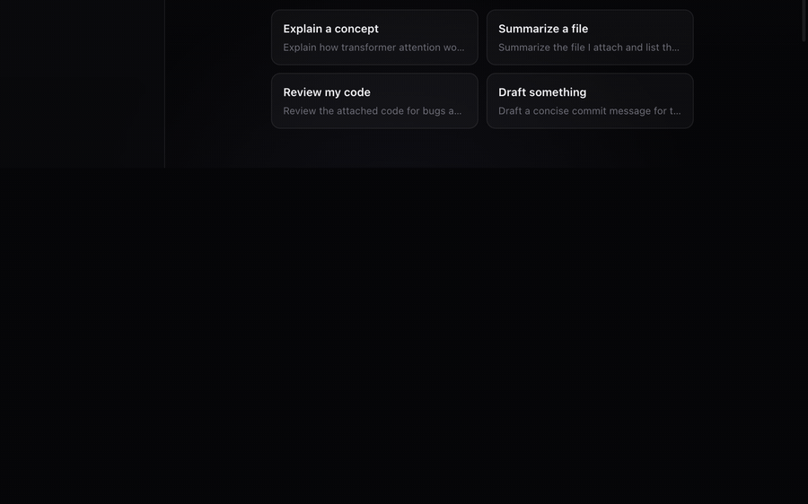
</div>

---

## Commands

| Command | Usage | Purpose |
|---------|-------|---------|
| `recommend` | `local-llmup [--task <t>] [--context <n>] [--json]` | Rank models that fit (default command) |
| `can-run` | `local-llmup can-run <model> [--context <n>] [--installed] [--json]` | Check one model at a chosen context |
| `doctor` | `local-llmup doctor [--json]` | Hardware + backend diagnostics |
| `up` | `local-llmup up <model> [--port <p>] [--backend <b>] [--context <n>] [--bypass]` | Verify and serve, optionally overriding estimated fit |
| `chat` | `local-llmup chat [-m <model>]` | Interactive chat with memory |
| `gui` | `local-llmup gui [--port <p>] [--harness <h>] [--no-open]` | Launch the browser workspace |
| `ls` | `local-llmup ls` | Show active server |
| `switch` | `local-llmup switch <model> [--context <n>] [--bypass]` | Change active model or context |
| `down` | `local-llmup down [model]` | Stop server |
| `migrate` | `local-llmup migrate --from <a> --to <b> [--dry-run]` | Move memory between models |
| `catalog` | `local-llmup catalog [--all] [--refresh]` | Browse model catalog |

### Global Options

```
--task <task>         Boost models for: chat|code|vision|reasoning|tools|embedding
--context <tokens>    Size KV cache at N tokens and re-rank
--max-context         Report largest holdable context per model
--backend <name>      Scope to: ollama|llamacpp|mlx|lmstudio
--available-backends  Only show models an installed backend can serve
--json                Machine-readable JSON output
--no-tui              Force plain text mode
--accessible          Force accessible mode
-h, --help            Help
-v, --version         Version
```

### Installed Models and Custom Context

Check the models you already use in Ollama, including tags missing from the
offline catalog:

```bash
local-llmup recommend --installed --context 65536
local-llmup recommend --installed --context 65536 --fits-only
local-llmup can-run gemma4:e4b-it-qat --installed --context 65536
local-llmup up gemma4:e4b-it-qat --installed --bypass --context 65536
local-llmup ls
```

Use an exact tag from the installed list for other models, including newly
released Qwen variants. Add `--port 11435` to installed checks or `up` for a
custom Ollama port. `switch <tag> --installed --bypass --context 65536` reuses
the active server's port. Installed models require an already-running Ollama.

`--bypass` overrides estimated fit, **not integrity checks**. Catalog launches
retain disk and weight verification. Installed mode verifies the local manifest
and every referenced blob, retaining catalog verification requirements when
available. Set `OLLAMA_MODELS` to the daemon's actual model directory when it
differs from `~/.ollama/models`; unreadable or mismatched content blocks launch.
Local manifest integrity is not independent provenance or catalog approval.

Explicit context creates a separate `llmup-context-...:<tokens>` runtime tag
with Ollama's `num_ctx` parameter. Your original tag and external daemon remain
unchanged. CLI and desktop chat use the configured tag automatically. For
OpenCode or another OpenAI-compatible client, select the **Runtime model** shown
by `local-llmup ls`, using the displayed endpoint plus `/v1`. The generated tags
remain in Ollama until explicitly removed; no automatic model deletion occurs.

In desktop **Models**, select **Installed Ollama**, choose **64K** or **Custom**,
and enable **Bypass estimated fit** before starting. The same context controls
also evaluate catalog recommendations and are passed to activation.

Weights fitting in VRAM do not prove the full context fits. Installed comparisons
use measured on-disk bytes, known fp16 KV geometry where supported, and reserved
memory headroom; missing or hybrid architecture geometry remains `unknown`.
`--fits-only` excludes unknown context fits. These are estimates, not observed GPU
allocation, CPU-offload detection, or throughput benchmarks. Ordinary advice
remains offline; only explicit `--installed` checks query the local runtime.
Runtime context configuration currently supports Ollama; other backends reject
it rather than ignore it.

See Ollama's [context-size guidance](https://docs.ollama.com/openai#setting-the-local-context-size)
and [model creation API](https://docs.ollama.com/api/create).

### Machine-Readable Output

```json
{
  "hardware": { "arch": "arm64", "platform": "darwin", "usableBytes": 36507222016 },
  "ranked": [
    {
      "rank": 1,
      "id": "qwen3:30b-a3b",
      "params": "30B",
      "quant": "Q4_K_M",
      "verdict": "yes",
      "score": 0.78,
      "throughput": { "known": true, "lowTokPerSec": 55.6, "highTokPerSec": 103.3 },
      "backends": ["ollama", "llamacpp", "lmstudio"]
    }
  ],
  "wontFit": [{ "id": "llama3.1:70b", "reason": "ram-bound" }]
}
```

---

## Supported Backends

| Backend | Platform | Lifecycle | Notes |
|---------|----------|-----------|-------|
| **Ollama** | All | Full (pull/serve/stop) | Default. Managed daemon. |
| **llama.cpp** | All | Full (pull/serve/stop) | Self-managed GGUF with HF acquisition |
| **MLX** | macOS (Apple Silicon) | Full (pull/serve/stop) | `mlx-lm` Python package |
| **LM Studio** | All | Attach-only | User manages the server; llmup attaches |

**Auto-selection logic:**
- Apple Silicon → MLX preferred (when installed)
- Everywhere else → Ollama preferred (when installed)
- Override with `--backend <name>`

All backends bind to `127.0.0.1` only. Integrity verification is SHA-256 for
self-managed pulls; LM Studio uses delegated integrity with a named trust boundary.

---

## How Advice Works

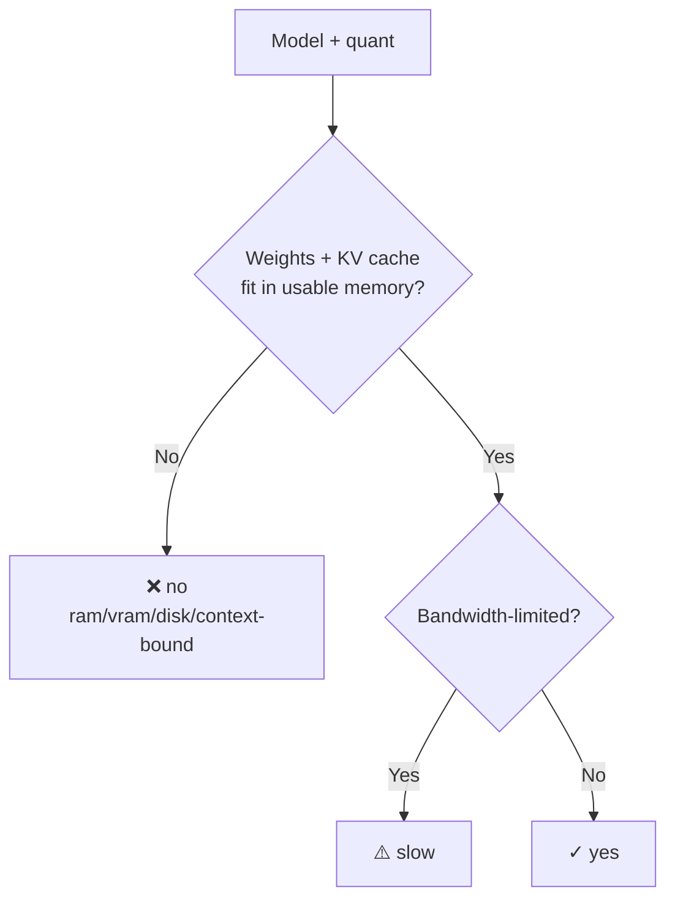
```mermaid
flowchart TD
    A["Model + quant"] --> B{"Weights + KV cache<br/>fit in usable memory?"}
    B -- No --> C["❌ no<br/>ram/vram/disk/context-bound"]
    B -- Yes --> D{"Bandwidth-limited?"}
    D -- Yes --> E["⚠️ slow"]
    D -- No --> F["✓ yes"]
```

| Principle | Implementation |
|-----------|---------------|
| **Offline** | Zero network calls. Curated dataset in `crates/llmup-core/data/` |
| **Deterministic** | Same hardware → same output, always |
| **Memory-bandwidth model** | tok/s from hardware bandwidth × model size |
| **KV-cache aware** | `--context N` includes fp16 KV (GQA-correct geometry) |
| **Honest** | Unknown → `unknown`, never fabricated |

**AI Hardware Score** is a blend of VRAM, RAM, compute, and storage sub-scores
(each 0–1). The lowest sub-score is surfaced as your bottleneck:

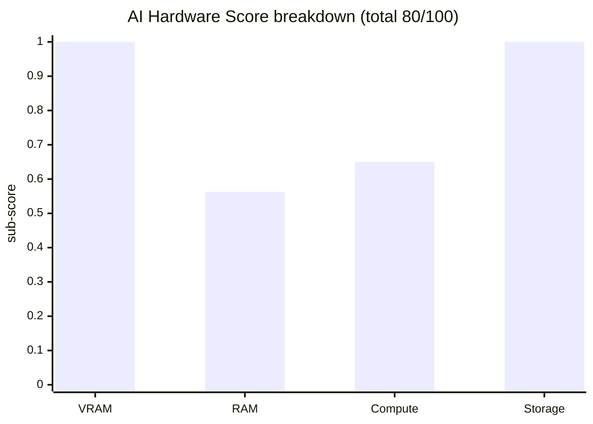
```mermaid
xychart-beta
    title "AI Hardware Score breakdown (total 80/100)"
    x-axis ["VRAM", "RAM", "Compute", "Storage"]
    y-axis "sub-score" 0 --> 1
    bar [1, 0.5625, 0.65, 1]
```

---

## Scripting & Exit Codes

| Command | Exit 0 | Exit 1 |
|---------|--------|--------|
| `can-run` | `yes` or `slow` | `no` |
| `doctor` | All checks pass | Any check fails |
| `recommend` | Success | Invalid input |
| `up` | Model served | Verification/pull failed |

```bash
# CI gate example
if local-llmup can-run llama3.1:8b; then
  local-llmup up llama3.1:8b
fi
```

---

## local-llmup vs. Ollama

| Feature | Ollama | local-llmup |
|---------|--------|-------------|
| Run inference | ✅ | ✅ (via backends) |
| Hardware-aware recommendations | ❌ | ✅ |
| Quantization selection | ❌ | ✅ |
| Multi-backend (4 runtimes) | ❌ | ✅ |
| Integrity-verified pulls (SHA-256) | ❌ | ✅ |
| Context-window sizing | ❌ | ✅ |
| Memory migration between models | ❌ | ✅ |
| Interactive TUI | ❌ | ✅ |
| AI Hardware Score | ❌ | ✅ |
| Accessible mode (screen readers) | ❌ | ✅ |

> **Homebrew for local LLMs** — hardware-aware model selection with a consistent
> workflow across runtimes.

---

## SOTA Landscape (August 2026)

This snapshot compares `local-llmup` with the leading local inference and
workspace tools as of **2026-08-30**. It is a capability map, not a benchmark
ranking; runtimes and model support change quickly.

| Project | Best at | How `local-llmup` complements it |
|---------|----------|----------------------------------|
| [Ollama](https://ollama.com) | Simple model pull, local serving, and an OpenAI-compatible API | Adds hardware-fit verdicts, throughput estimates, integrity checks, and lifecycle portability |
| [llama.cpp](https://github.com/ggerganov/llama.cpp) | Portable, dependency-light inference across CPU/GPU backends and quantizations | Adds model selection before download and a consistent orchestration layer |
| [MLX-LM](https://github.com/ml-explore/mlx-lm) | Apple Silicon generation, quantization, and fine-tuning | Adds cross-platform recommendations and backend selection |
| [LM Studio](https://lmstudio.ai) | GUI-first model discovery, chat, and local API serving | Adds deterministic CLI/TUI workflows, scriptable output, and memory migration |
| [vLLM](https://github.com/vllm-project/vllm) | High-throughput, concurrent GPU serving with batching and distributed execution | Targets the single-user, hardware-constrained local workflow and can-run decisions |
| [LocalAI](https://github.com/mudler/LocalAI) | OpenAI-compatible multi-backend server for LLM, vision, voice, and image workloads | Adds catalog-backed hardware sizing and verified model lifecycle operations |
| [AnythingLLM](https://github.com/Mintplex-Labs/anything-llm) | Document workspaces, agents, and multi-user knowledge workflows | Adds runtime-aware model recommendations underneath the workspace layer |
| [DeepGit](https://github.com/zamalali/DeepGit) | Semantic GitHub repository discovery, reranking, quality analysis, and hardware-aware filtering | Complements repository research with local model fit, installation, serving, and migration workflows |

**Positioning:** the major tools above optimize inference, serving, or
application UX, while DeepGit focuses on discovering and analyzing repositories.
`local-llmup` is the decision and lifecycle layer between a machine and local
inference runtimes: measure the hardware, explain what fits, choose a backend,
verify the weights, then serve and migrate without guessing.

---

## FAQ

### How do I find out which LLMs my computer can run?

Install `local-llmup` and run `llmup` with no arguments. It detects your GPU,
VRAM, RAM and free disk, ranks every catalog model that fits, and lists the ones
that don't with the binding reason (`vram-bound`, `ram-bound`, `disk-bound` or
`context-bound`). `llmup can-run <model>` answers for a single model and exits
non-zero when the answer is `no`.

### How much VRAM do I need to run Llama, Qwen, Gemma or DeepSeek locally?

These are `local-llmup`'s offline estimates of the memory each model needs at
`Q4_K_M` and its default context. Your usable memory must be at least this much;
longer contexts add KV cache on top. Reproduce them with `llmup catalog --all`.

| Model | Parameters | Estimated memory (Q4_K_M) |
|-------|-----------:|--------------------------:|
| `llama3.2:3b` | 3B | 2.2 GiB |
| `llama3.1:8b` | 8B | 5.3 GiB |
| `qwen3:8b` | 8B | 5.6 GiB |
| `gemma3:12b` | 12B | 8.7 GiB |
| `qwen3:14b` | 14B | 9.9 GiB |
| `mistral-small:24b` | 24B | 15.4 GiB |
| `gemma3:27b` | 27B | 18.6 GiB |
| `qwen3:30b-a3b` | 30B (3B active) | 19.9 GiB |
| `qwen3:32b` | 32B | 21.6 GiB |
| `mixtral:8x7b` | 47B | 29.6 GiB |
| `llama3.3:70b` | 70B | 45.5 GiB |
| `deepseek-r1:70b` | 70B | 45.5 GiB |
| `qwen3:235b-a22b` | 235B | 152.2 GiB |
| `deepseek-r1:671b` | 671B | 433.2 GiB |

### Can I run local LLMs on a Mac with Apple Silicon?

Yes. On Apple Silicon the GPU shares unified memory with the CPU, so
`local-llmup` sizes models against system memory rather than a separate VRAM
pool. It auto-selects MLX for models with an MLX build, then Ollama, then
llama.cpp.

### How are tokens per second estimated?

Decode speed on consumer hardware is mostly limited by memory bandwidth, so the
estimate combines the model's size at the chosen quantization with a curated,
cited throughput dataset for your hardware class. When your hardware isn't in the
dataset the speed is shown as `unknown` instead of a guess. Estimates are not
benchmarks.

### Does local-llmup send my data anywhere?

No. Recommendations, `can-run` and `doctor` make no network calls and use a
bundled offline catalog. Model servers and the browser GUI bind to `127.0.0.1`
only. It reaches the internet only when you pull weights, choose a cloud chat
harness, or run the maintainer catalog tools.

### Is local-llmup an alternative to Ollama or LM Studio?

It works alongside them. Ollama, llama.cpp, MLX and LM Studio run inference;
`local-llmup` decides which model and quantization your machine can handle,
verifies the download, and manages the server through whichever runtime you have.

---

## Development

Use the pinned Rust toolchain (`rust-toolchain.toml`). No Node.js is required for
building, testing or releasing.

```bash
cargo build --workspace --locked
cargo test --workspace --locked -- --test-threads=2
cargo clippy --workspace --all-targets --locked -- -D warnings
cargo fmt --all -- --check
cargo native-retirement  # Fails if any Node/TypeScript tooling returns
cargo llmup              # Native development CLI
cargo state-parity
cargo workflow-parity
cargo catalog-bootstrap  # Regenerate crates/llmup-core/data/models.json
```

Browser client modules and journeys run in real Chrome through WebDriver:

```bash
scripts/native-browser-journeys.sh "$CHROME" "$CHROMEDRIVER"
```

### Architecture

```text
crates/llmup-core/       Offline catalog, sizing, advice and ranking (+ data/)
crates/llmup-runtime/    Runtime adapters, state, memory, tools and workspace
crates/llmup-cli/        Native public aliases, terminal UI and maintenance
crates/llmup-gui/        Rust HTTP/SSE host and embedded static browser assets
vendor/crossterm/        llmup-crossterm: crossterm with bounded input parsing
apps/desktop/src-tauri/  Native desktop (separate Cargo project)
```

### Testing Philosophy

- **TDD.** Failing test → minimal implementation → refactor.
- **All mocked.** No real network, models or inference in the test suite.
- **Frozen oracles.** Advice, fit and state behaviour are pinned against
  outputs captured from the 0.x implementation.
- **Unit > integration > e2e.** Browser and desktop journeys run separately.
- **Runtime smoke.** Real backend processes are tested separately via production builds.

---

## Troubleshooting

| Problem | Solution |
|---------|----------|
| `up` fails with size mismatch | Re-run — likely an interrupted download |
| `ollama is not installed` | Install from [ollama.com](https://ollama.com); advice commands still work |
| Throughput shows `unknown` | Your hardware bandwidth isn't in the dataset |
| TUI not rendering | Check terminal size ≥60×16, or use `--no-tui` |
| Screen reader not working | Use `--accessible` flag |
| KV Cache shows `unknown` | Model's attention geometry isn't in the dataset |

---

## License

[MIT](LICENSE)
