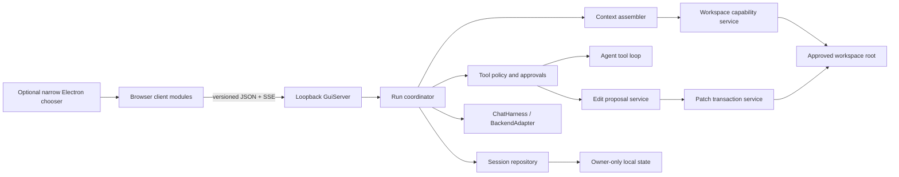
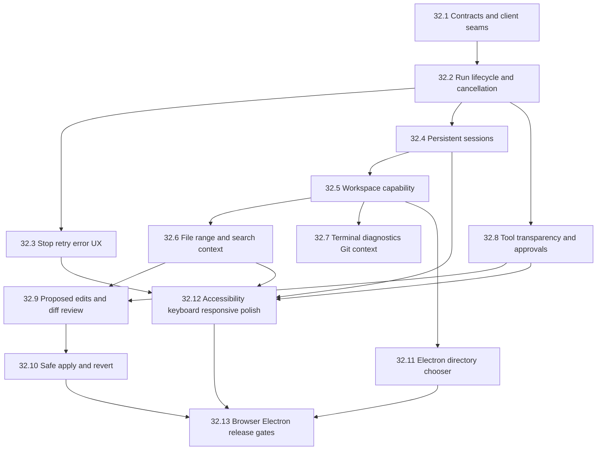

# Implementation Plan: Chat Panel Workspace Experience

> Status: Approved — all decision gates (1–4) approved 2026-08-30
> Last updated: 2026-08-30
> Related spec: [GUI and harness adapters](../specs/gui-and-harness-adapters.md)
> Related plans: [task 31](./task-31-gui-harness-adapters.md), [task 30](./task-30-terminal-user-interface.md)

## Overview

Incrementally evolve the loopback browser/Electron chat surface into a workspace-aware coding assistant. Public interaction patterns from GitHub Copilot Chat, Codex, and Claude Code are UX benchmarks only; this plan does not assume or reproduce proprietary internals.

The highest-value path is:

1. Fix the message and streaming lifecycle.
2. Add stop, retry, durable errors, and clear run states.
3. Add persistent multi-session history.
4. Add explicit, read-only workspace context (`@file`, ranges, search, pasted terminal/diagnostics, and Git state).
5. Make tool calls transparent and approval-gated.
6. Add proposed edits, reviewable diffs, safe apply, and guarded revert.
7. Complete keyboard, accessibility, responsive, browser, and Electron validation.

This is not a framework rewrite. Each phase is independently useful and keeps ordinary chat available if later workspace capabilities are disabled.

## Design guardrail: simplicity first

Every feature below is subject to a hard usability constraint: **the default surface must stay as simple as an ordinary chat box, and no capability may raise the baseline learning curve.** Depth is opt-in, never front-loaded.

Rules:

- The first-run panel shows only a message composer, the conversation, and Send. Nothing else competes for attention.
- Every advanced capability (workspace, context, tools, diffs, sessions) is progressive disclosure: collapsed, discoverable on demand, and dismissible back to plain chat.
- Prefer one obvious action over many configurable ones. Expose expert controls behind an explicit "advanced" affordance, never inline by default.
- New affordances reuse existing patterns (chips, a single context button, one Stop/Send toggle) instead of adding new interaction models.
- A user who ignores every advanced feature must still have a complete, unconfusing chat experience.
- No feature ships if it forces the user to learn new vocabulary or configuration before sending a first message.

This guardrail is a release gate, not an aspiration: any task that measurably increases baseline complexity is rejected or redesigned.

## Competitive context and differentiation

Market research on LM Studio (classic app and the separate Bionic product) shows most basic features—persistent chats, search, export, split view, MCP, authenticated APIs, headless serving, and, in Bionic, coding workspaces with diffs and rollback—already exist. Recreating that checklist is not the opportunity. The differentiators this plan should protect are:

1. **Honest accounting over hidden behavior** — an inspectable context ledger (included/excluded/truncated context, prior turns, and usage only when known) rather than silent truncation.
2. **Predictable, transparent lifecycle** — observable run states, real cancellation, and recoverable errors instead of opaque progress.
3. **Reliability and safety first** — verified inputs, fail-closed workspace access, and hash-guarded edits over broad-but-fragile capability.
4. **Auditable local-first control** — every mutation visible, bounded, and reversible; no invisible authority.
5. **A single coherent surface** — one workflow from chat to workspace, avoiding the classic/Bionic product split.

Crucially, these advantages must be delivered **without** adopting the visual and cognitive density of feature-maximal competitors. The edge is trustworthy simplicity, not more surface area.

## Long-term product vision

LM Studio's trajectory is roughly **Discovery → Runtime → Agent → Cloud → Teams → Enterprise** — a general-purpose local-AI platform that keeps widening its surface area.

`local-llmup` pursues a different arc, anchored on hardware-aware honesty rather than feature breadth:

**Model discovery → Hardware compatibility → Benchmarking → Model recommendation → One-click deployment → Fleet management → Enterprise**

| Stage | What it delivers | Status vs. this plan |
|---|---|---|
| Model discovery | Curated, cited offline catalog | Exists (`data/`, catalog commands) |
| Hardware compatibility | `yes / slow / no / unknown` verdicts and prerequisites | Exists (advisor/hardware engine) |
| Benchmarking | Predicted vs. measured throughput, honest ranges | Partial; measured-vs-predicted history is a differentiator to grow |
| Model recommendation | Ranked, weighted fit under real constraints | Exists (ranking) |
| One-click deployment | Verified pull → serve → ready, then **use** | `up`/serve exists; **this panel is the "use" surface** |
| Fleet management | Multiple machines/runtimes under one control plane | Future; foreshadowed by runtime-independent `BackendAdapter` |
| Enterprise | Policy, audit, and provenance at scale | Future; foreshadowed by auditable, fail-closed, loopback-first design |

**Where task 32 sits.** The chat panel workspace experience is the `local-llmup` equivalent of the "Agent" stage — but deliberately built *on top of* discovery, compatibility, recommendation, and deployment rather than as a standalone chat product. It is the surface where a user moves from "what will run here?" to "use it on my work," without a product switch.

**Design commitments that must survive every stage:**

- **Simplicity compounds.** Each later stage (fleet, enterprise) is added as opt-in capability, never by raising the baseline. The plain-chat default and progressive disclosure from the simplicity guardrail apply to fleet and enterprise surfaces too.
- **Honesty scales.** The context ledger, `unknown` gate, and measured-vs-predicted transparency are the through-line from single-machine advice to fleet and enterprise reporting.
- **Runtime independence is the seam.** Keeping commands and UI behind `BackendAdapter` is what makes fleet management (many runtimes/hosts) and enterprise policy tractable later without a rewrite.
- **Auditable, fail-closed, loopback-first.** The same properties that make single-user workspace edits safe are the foundation for enterprise audit and provenance.

This plan implements only the deployment-to-use bridge and the read/edit workspace surface. Fleet and enterprise stages are explicitly out of scope here (see Non-goals) but are kept reachable by the architecture choices above.

## Assumptions

1. `GuiServer` remains the shared runtime host for the browser and Electron surfaces.
2. The server remains loopback-only; no remote access or permissive CORS is added.
3. The initial client remains vanilla browser HTML/CSS/JavaScript. Client code is split into testable modules before more behavior is added.
4. The server owns canonical sessions, message ordering, run state, approvals, and workspace capabilities.
5. Persistent chat sessions use a separate, versioned owner-only store rather than changing extracted-memory semantics.
6. Workspace access starts only after explicit root selection; the process working directory is not silently granted.
7. File and range references are immutable, bounded snapshots shown to the user before submission.
8. Terminal and diagnostic context is explicitly pasted/imported at first; it is never captured silently.
9. Git context is read-only and uses fixed executable/argument vectors without a shell.
10. Workspace content sent to a cloud harness requires a visible disclosure decision.
11. MCP metadata is untrusted. Local policy decides whether a tool needs approval.
12. Model-generated edits remain inert proposals until reviewed and explicitly applied.

## Non-goals

- Reproduce proprietary prompts, ranking, protocols, or assistant internals.
- Build a VS Code extension, debugger adapter, or language-server client in this task.
- Add remote access, collaboration, multi-user authentication, or shared sessions.
- Grant autonomous access outside an explicitly approved workspace root.
- Add unattended arbitrary shell execution.
- Let a model or connector bypass approval or patch validation.
- Replace `BackendAdapter`, `ChatHarness`, or the shared runtime-host architecture.
- Change deterministic offline behavior in advice commands.
- Store API keys or authentication tokens in chat history.
- Perform a UI-framework migration.
- Add multi-model comparison or background autonomous agents in the initial roadmap.

## Verified current state and gaps

| Area | Current evidence | UX/architecture gap |
|---|---|---|
| Client | `src/gui/static/index.html`, `chat.js`, and `styles.css` form one static vanilla client. `chat.js` contains transport, state, rendering, and management logic. | The monolith has no isolated client state machine or SSE parser tests, making richer interactions risky. |
| Runtime host | `GuiServer.start()` binds `127.0.0.1`; every request is protected by exact `Host` validation. | Read/write workspace APIs also need exact `Origin`, content-type, and per-launch capability protection. |
| Electron | The window is sandboxed with context isolation and no Node integration or preload bridge. | There is no native directory chooser; any future bridge must remain extremely narrow. |
| Session | `GuiServer` owns one `GuiSession`; `appendConversation()` retains only the final 20 messages in memory. | Refresh/server restart loses history; no create, rename, switch, search, archive, or delete flow exists. |
| Context continuity | The browser sends only the latest user message. The server records prior messages but does not automatically add them to the next harness request. | Multi-turn model context is incomplete despite the UI showing prior turns. |
| Streaming | The client splits each received network chunk on blank lines without retaining an incomplete SSE frame. | Events split across chunks can be lost or malformed. |
| Cancellation | `HarnessChatRequest` already supports `AbortSignal`, and provider/backend contracts have cancellation seams. The GUI does not create or propagate a signal; the agent loop lacks one. | No Stop action and late completions can outlive user intent. |
| Errors/retry | Chat failures become transient system messages; there is no run identity, retry linkage, or durable partial-response state. | Failures are hard to understand and recover from. |
| Tools | The agent loop emits tool name plus start/done/error, and the UI shows minimal activity rows. Tool calls execute immediately. | Inputs, outputs, duration, connector, risk, approval, cancellation, and audit state are missing. |
| Workspace | No workspace root, file tree/search, selection, diagnostics, Git, edit proposal, apply, or revert APIs exist. | Chat cannot safely reason about or modify a project. |
| Tests | GUI server/domain tests exist, including loopback HTTP/SSE integration. | Static-client unit tests, arbitrary SSE fragmentation tests, real-browser journeys, accessibility automation, and Electron tests are absent. |

## UX principles

- **Simplicity first:** the default view is plain chat; every added capability is opt-in progressive disclosure that collapses back to plain chat and adds no baseline learning curve.
- **Observable lifecycle:** sending, assembling context, awaiting approval, running, stopping, completed, cancelled, and failed are distinct states.
- **User-controlled context:** every included file, range, diagnostic, terminal excerpt, Git snapshot, and prior turn is visible and removable.
- **No invisible authority:** workspace selection grants a bounded capability, not unrestricted filesystem or shell access.
- **Review before mutation:** edits are proposals until reviewed and applied.
- **Recoverable failures:** errors preserve the prompt, partial answer, context manifest, and retry action.
- **Visible data boundary:** local versus cloud destination is always clear.
- **Progressive disclosure:** tool details and large diffs are inspectable but collapsed by default.
- **Keyboard-first and accessible:** all core flows work without a pointer and announce state changes appropriately.
- **Honest status:** unknown usage, unavailable diagnostics, excluded secrets, and truncated context are shown explicitly.

## Success metrics

### Reliability

- SSE fixtures pass when split at every byte boundary, including multibyte UTF-8 boundaries.
- Every run has exactly one terminal state: `completed`, `cancelled`, or `failed`.
- Stop reaches harness/backend/tool cancellation seams and prevents a late completion from appending a final assistant message.
- A second turn contains the bounded canonical prior exchange exactly once.
- Retry links to the original run without duplicating its user message.
- Restart recovery never restores an interrupted run as active.

### Workspace safety

- Traversal, absolute path, NUL, encoded traversal, symlink escape/swap, binary, denied-secret, oversized-file, and non-regular-file fixtures fail closed.
- No workspace operation works before explicit root selection.
- Sensitive and mutating routes require valid Host, Origin, JSON content type, and a per-launch token.
- Cloud-bound workspace context cannot be sent without a recorded disclosure decision.
- Stale or tampered edit bases modify zero files.
- Guarded revert never overwrites changes made after apply.

### Learning curve and simplicity

- First-run panel renders only composer, conversation, and Send; no advanced control is visible until invoked.
- A user can complete a full send/receive/stop/retry cycle without opening any workspace, context, tool, session, or diff surface.
- Every advanced surface is reachable from a single discoverable affordance and returns to plain chat when dismissed.
- No feature adds new required configuration, vocabulary, or setup before the first message.
- Advanced/expert controls live behind an explicit disclosure, never inline in the default composer.

### UX and accessibility

- Stop is visible for every active run and immediately changes to `Stopping…`.
- Cancelled and failed runs retain prompt, partial response, context summary, and retry.
- Session creation, switching, rename, search, archive/delete, context attachment, tool approval, diff navigation, apply, and revert work by keyboard.
- Dynamic states have dedicated empty/loading/offline/error/approval/conflict/cancelled presentations.
- Required journeys work at 320, 768, 1024, and 1440 px, at 200% zoom, with reduced motion.
- WCAG 2.1 AA keyboard, focus, naming, contrast, and announcement checks pass.

### Performance

- Establish baselines before enforcing numeric budgets.
- Session and workspace searches are paginated/streamed and cancellable.
- The panel remains responsive with fixtures containing 500 messages and 100 search results.
- No token estimate is shown unless supplied by the backend or an approved tokenizer.

## Target architecture



### Module boundaries

- **Contracts:** versioned Zod schemas for JSON resources, persisted documents, and SSE events.
- **Transport/router:** route matching, security headers, request limits, and structured errors.
- **Run coordinator:** IDs, valid state transitions, one active run per session initially, cancellation, retry linkage, and terminal-state guarantees.
- **Session repository:** owner-only, schema-versioned persistence, atomic writes, revisions, pagination, search, and restart recovery.
- **Context assembler:** bounded canonical conversation plus approved immutable context snapshots.
- **Workspace service:** capability registration, canonical containment, tree, read, and search.
- **Context providers:** file/range, pasted terminal, imported diagnostics, and read-only Git snapshots.
- **Tool policy:** risk classification, approvals, redaction, result limits, cancellation, and session-scoped grants.
- **Edit proposal service:** validates structured operations and produces review diffs without mutation.
- **Patch transaction service:** lock, hash revalidation, staging, deterministic apply, rollback, and guarded revert.
- **Client modules:** API transport, buffered SSE parser, reducer/state machine, feature renderers, and keyboard actions.
- **Electron bridge:** optional directory selection only; all file access remains server-side.

## Core contracts

### Run state machine

```text
queued
  -> assembling-context
  -> awaiting-disclosure | awaiting-tool-approval | running
  -> stopping
  -> completed | cancelled | failed
```

Invalid transitions fail closed. Terminal states are mutually exclusive.

### Versioned event envelope

Every new event includes:

- `schemaVersion`
- `requestId`
- `sessionId`
- `runId`
- monotonic per-run `sequence`
- discriminant `type`
- server `createdAt`

Initial event union:

- `run.started`
- `run.state`
- `assistant.delta`
- `assistant.snapshot`
- `context.warning`
- `tool.proposed`
- `tool.approval-required`
- `tool.started`
- `tool.completed`
- `edit.proposed`
- `run.completed`
- `run.cancelled`
- `run.failed`
- `heartbeat`

The client buffers incomplete frames and UTF-8 sequences. Unknown additive event types are ignored safely; malformed known events fail the affected run visibly.

### Resource groups

Use an additive versioned namespace while retaining legacy routes during preview:

- sessions: create, list/search, read paginated messages, rename/archive/delete;
- runs: start SSE run, read current state, cancel idempotently, retry;
- workspaces: register/revoke root capability, list tree, read ranges, search;
- context snapshots: create and preview immutable bounded snapshots;
- approvals: approve once, allow exact tool for session, or deny;
- edit proposals: read/approve review model;
- edit applications: apply and guarded revert.

All request, response, event, and persisted shapes are Zod-validated.

## Security model

### Local HTTP boundary

Preserve exact Host validation and add, before workspace features:

- exact same-origin validation on sensitive/mutating requests;
- JSON-only mutation requests;
- random per-launch token in a custom header, never in URLs/logs/model context/persistence;
- no wildcard CORS;
- restrictive CSP, framing, referrer, and MIME-sniffing headers;
- bounded request concurrency and one active run per session initially.

The token is local capability/CSRF defense, not multi-user authentication.

### Workspace root and paths

- Default to no workspace capability.
- Select and confirm a canonical root explicitly.
- Use opaque capability IDs in browser APIs.
- Validate bounded UTF-8 relative paths; reject NUL, absolute/drive/UNC paths, empty segments, `.` and `..`.
- Enforce lexical and canonical containment.
- Reject symlinks for writes initially; reject for reads until cross-platform behavior is proven.
- Require regular files and use `O_NOFOLLOW`/descriptor checks where available.
- Revalidate containment, metadata, and content hash immediately before mutation.

### Content filtering

- Deny common environment, credential, private-key, package-auth, cloud-auth, and local-llmup secret paths.
- Exclude `.git` internals; expose only dedicated bounded Git summaries.
- Treat ignore files as an additional filter, not the security boundary.
- Detect binary content from bytes/encoding, not extension alone.
- Apply per-file, per-snapshot, per-run, search-result, and aggregate context limits.
- Surface every exclusion and truncation; do not silently omit selected context.

### Cloud disclosure

Before an external harness receives workspace content, show provider, model, file/range list, total bounded size, and filtering status. Require confirmation under the approved policy and invalidate it when provider, root, or material context changes.

### Tool policy

- Local policy classifies tools as read-only, process/network, workspace mutation, or unknown.
- Unknown is highest risk.
- Start with approval required for every call; later permit exact-tool session grants only.
- Connector claims, tool schemas, inputs, and results are untrusted.
- Redact secret-shaped values and cap previews/persisted summaries.
- Workspace mutation goes through the edit service, never direct arbitrary writes.

### Safe edits

Model/tool output produces structured create/update/delete operations with base hashes and bounded hunks. The server generates the review diff. It never pipes model patch text to a shell or `git apply`.

Apply must:

1. Acquire a workspace-scoped lock.
2. Re-read and hash every target.
3. Reject stale bases, symlinks, unsupported types, and denied paths.
4. Stage resulting files on the same filesystem with restrictive permissions.
5. Validate staged hashes.
6. Replace in deterministic order.
7. Roll back already-replaced files after any failure.
8. Record bounded before/after hashes and rollback material.
9. Revert only when current hashes equal the exact applied hashes.

Formatting, tests, Git commands, and hooks are separate approved actions, never implicit apply side effects.

## Dependency graph



## Phase A — Correct chat lifecycle

### Task 32.1 — Freeze contracts and add client test seams

**Description:** Define additive Zod schemas for runs, sessions, context references, structured errors, and SSE events. Extract API transport, buffered SSE parsing, and a pure client reducer from the monolithic script without changing visible behavior.

**Acceptance criteria:**

- Every documented request/response/event has positive and negative contract tests.
- SSE fixtures pass at arbitrary chunk and UTF-8 boundaries.
- Client run transitions are testable without a DOM.
- Existing legacy routes and management views remain unchanged.

**Verification:** GUI tests, typecheck, lint, build.

**Dependencies:** None.

**Likely files:** `src/gui/contracts.ts` (new), `src/gui/static/chat.js`, new client modules under `src/gui/static/`, `tests/gui/contracts.test.ts`, `tests/gui/client-stream.test.ts`.

**Scope:** M; split extraction from contract introduction if needed.

### Task 32.2 — Implement server-owned runs and cancellation

**Description:** Add a run coordinator with unique IDs and owned `AbortController`s. Build each model request from canonical server session state. Wire one signal through disconnect, explicit stop, agent loop, harness, backend, and tool execution.

**Acceptance criteria:**

- The second turn receives bounded prior user/assistant context exactly once.
- Stop and disconnect cancel normal and agent-tool paths with one terminal event.
- Late completion cannot append a final assistant message after cancellation.
- A second active run in the same session returns a typed conflict.

**Verification:** GUI, harness, backend, and agent tests; typecheck, lint, build.

**Dependencies:** 32.1.

**Likely files:** `src/gui/run.ts` (new), `src/gui/server.ts`, `src/gui/session.ts`, `src/gui/agent.ts`, harness/backend adapters as required, GUI/agent tests.

**Scope:** M; normal and agent cancellation may be separate commits.

### Task 32.3 — Add stop, retry, partial-response, and error UX

**Description:** Render the run state machine. Preserve the prompt, partial output, selected context, and safe structured errors. Retry creates a linked run rather than duplicating the user message.

**Acceptance criteria:**

- Active send changes Send to Stop and prevents duplicate submission.
- Stop immediately displays `Stopping…` and resolves to cancelled.
- Failed/cancelled runs retain partial content and expose retry.
- Network loss, malformed stream, restart, and unavailable harness have distinct recoverable states.

**Verification:** Client/GUI tests, real-browser manual journey, typecheck, lint, build.

**Dependencies:** 32.2.

**Likely files:** client state/render modules, `index.html`, `styles.css`, `server.ts`, GUI tests.

**Scope:** M.

### Checkpoint A — Lifecycle

- Canonical multi-turn context works.
- Cancellation reaches every chat path.
- Exactly one terminal state exists per run.
- Stop/retry/partial/error flows work in a real browser.
- Model, runtime, connector, and library flows remain green.

## Phase B — Durable sessions

### Task 32.4 — Add persistent multi-session history

**Description:** Introduce a schema-versioned `SessionRepository` with owner-only storage, atomic writes, bounded reads, optimistic revisions, pagination, local search, and restart recovery. Replace the single Current session entry with session management UI.

**Acceptance criteria:**

- Create, rename, switch, search, archive/delete, and restore-after-restart work.
- Corrupt, oversized, symlinked, wrong-version, or unsafe-permission state fails closed.
- Message/session APIs are cursor-paginated and bounded.
- Interrupted runs recover as failed/interrupted, never active.

**Verification:** GUI and memory-pattern tests, temporary-home restart integration, typecheck, lint, build.

**Dependencies:** 32.2; approval for storage layout and retention.

**Likely files:** `src/gui/session-repository.ts` (new), `src/gui/session.ts`, `server.ts`, client session modules, config/storage helpers, GUI tests.

**Scope:** Two M increments: repository/security, then API/UI.

### Checkpoint B — Sessions

- Session CRUD/search survives restart.
- Storage corruption fails closed.
- No unbounded history response exists.
- Persistence can be disabled while ordinary chat remains available.

## Phase C — Read-only workspace context

### Task 32.5 — Add workspace capability and safe read APIs

**Description:** Add explicit root registration/revocation, tree listing, bounded text reads, launch-token enforcement, and reusable path/content policy.

**Acceptance criteria:**

- No workspace operation works without an approved capability.
- Traversal, absolute path, encoded traversal, NUL, symlink, swap, non-regular, binary, denied-secret, and oversized fixtures fail closed.
- Sensitive routes require exact Host/Origin, JSON content type where applicable, and launch token.
- Responses expose relative display paths only.

**Verification:** GUI security fixtures, typecheck, lint, build.

**Dependencies:** 32.4; approval for root selection, deny policy, and launch token.

**Likely files:** new `src/gui/workspace/` modules, `handlers.ts`, `server.ts`, security-header/bootstrap code, GUI workspace tests.

**Scope:** Two M increments: capability/security, then tree/read.

### Task 32.6 — Add `@file`, ranges, and workspace search

**Description:** Add a keyboard-accessible context picker that searches the approved root, previews text, selects line ranges, creates immutable snapshots, and displays removable context chips.

**Acceptance criteria:**

- Context trigger/button opens a searchable keyboard-navigable picker.
- File/range snapshots include relative path, hash, range, size, and truncation state.
- Search is bounded, paginated/cancellable, and excludes denied/binary content.
- Run and persisted-message manifests record exactly the snapshots used.

**Verification:** GUI tests, real-browser keyboard journey, typecheck, lint, build.

**Dependencies:** 32.5.

**Likely files:** new context/search services, client picker modules, `index.html`, `styles.css`, GUI tests.

**Scope:** Two M increments: attach/preview, then search.

### Task 32.7 — Add explicit terminal, diagnostics, and Git context

**Description:** Add bounded pasted terminal/imported diagnostic snapshots and fixed read-only Git status/diff providers. Nothing is captured automatically.

**Acceptance criteria:**

- Pasted terminal/diagnostic data is previewed, labeled, bounded, removable, and never executed.
- Git uses fixed executable/arguments, no shell/hooks, timeout, and output caps.
- Missing Git, non-repository roots, invalid diagnostics, failures, and truncation are honest states.
- Every source appears in the context manifest and requires explicit user action.

**Verification:** Context-provider and GUI tests, browser composition check, typecheck, lint, build.

**Dependencies:** 32.5; may parallelize with 32.6 after snapshot contracts stabilize.

**Likely files:** new context providers, injected process seam, server routes, client context modules, tests.

**Scope:** Two S/M increments: pasted/imported context, then Git.

### Checkpoint C — Workspace reads

- Root selection is explicit and revocable.
- File search/preview/ranges, pasted terminal/diagnostics, and Git context work without mutation authority.
- Included, excluded, and truncated context is visible as an inspectable context ledger.
- The default composer is unchanged for users who never attach context; all context UI is opt-in and dismissible.
- Cloud disclosure is enforced.
- Workspace security fixtures pass.

## Phase D — Tools and reviewed edits

### Task 32.8 — Add transparent tools and approvals

**Description:** Extend tool events with stable call IDs, connector, bounded/redacted arguments/results, risk, duration, approval state, and cancellation. Stop immediate execution until policy allows it.

**Acceptance criteria:**

- Each call shows connector/tool, redacted input, state, duration, bounded result/error, and truncation.
- Approval-required calls cannot execute before a valid decision; denial is returned to the model as typed output.
- Stop prevents later tool steps and aborts an in-flight tool where supported.
- Session grants invalidate when connector, schema, policy, arguments, session, or workspace changes.

**Verification:** GUI, MCP, and agent tests; real-browser approve/deny/stop/error journey; typecheck, lint, build.

**Dependencies:** 32.2; approval-policy decision. Can parallelize with session work once event contracts are fixed.

**Likely files:** `agent.ts`, new policy/approval modules, `server.ts`, client tool renderer, MCP seams, tests.

**Scope:** M.

### Task 32.9 — Add structured edit proposals and diff review

**Description:** Validate bounded structured text create/update/delete proposals against workspace snapshots and generate server-side review diffs without changing files.

**Acceptance criteria:**

- Operations use relative paths, base hashes, and bounded non-overlapping hunks.
- Stale, binary, denied, symlinked, oversized, malformed, or overlapping proposals fail before review.
- UI shows changed files, additions/deletions, warnings, and navigable hunks.
- Viewing or approving a proposal modifies zero workspace files.

**Verification:** Proposal/diff tests, narrow/desktop browser review, typecheck, lint, build.

**Dependencies:** 32.6 and 32.8.

**Likely files:** new proposal/diff modules, routes, client diff renderer, styles, GUI tests.

**Scope:** M.

### Task 32.10 — Add transactional apply and guarded revert

**Description:** Implement locking, base-hash revalidation, same-filesystem staging, deterministic replacement, rollback, bounded application records, and result-hash-guarded revert.

**Acceptance criteria:**

- Apply writes exactly reviewed bytes and records per-file before/after hashes.
- Stale hashes, symlinks, permissions, staging failure, or injected mid-transaction failure leave or restore the original workspace.
- Revert succeeds only when current hashes equal applied-result hashes.
- Apply/revert require separate confirmation and emit durable audit events.

**Verification:** Temporary-workspace fault injection, GUI tests, typecheck, lint, build.

**Dependencies:** 32.9; approval for operation scope, limits, rollback storage, and retention.

**Likely files:** new patch transaction/record modules, routes, apply/revert UI, tests.

**Scope:** Two M increments: update/create apply, then delete/revert if approved.

### Checkpoint D — Safe workspace actions

- Tools are transparent and approval-gated.
- Edit proposals are inert until review.
- Apply is hash-guarded and fault-injection tested.
- Revert refuses to overwrite subsequent user changes.
- No shell-based patch path exists.
- Security review approves default enablement.

## Phase E — Desktop integration and polish

### Task 32.11 — Add an optional narrow Electron directory chooser

**Description:** If approved, expose only typed `selectWorkspaceDirectory()` from a preload backed by Electron's native directory dialog. File access remains exclusively in the loopback server.

**Acceptance criteria:**

- Preload exposes no Node, filesystem, process, shell, or arbitrary IPC APIs.
- Cancel grants nothing; selection still passes server canonicalization and policy.
- Sandbox, context isolation, disabled Node integration, and navigation restrictions remain intact.
- Browser mode remains usable through an explicit startup/manual root flow.

**Verification:** Desktop typecheck/build and focused Electron smoke; root quality gates.

**Dependencies:** 32.5; preload approval.

**Likely files:** `apps/desktop/src/main.ts`, new preload/types, desktop package config/tests.

**Scope:** S/M.

### Task 32.12 — Complete accessibility, keyboard, and responsive behavior

**Description:** Normalize semantics, shortcuts, focus, announcements, and responsive layouts across sessions, composer, context picker, tools, approvals, diffs, and run actions.

**Acceptance criteria:**

- Core flows work by keyboard with documented non-conflicting shortcuts.
- Streaming tokens do not flood an assertive live region; state changes are announced.
- Dialogs/popovers manage initial focus, trapping, Escape, and restoration.
- Required widths, 200% zoom, reduced motion, and high contrast pass.

**Verification:** Client/browser accessibility suite plus manual accessibility-tree and keyboard walkthrough; typecheck, lint, build.

**Dependencies:** 32.3, 32.4, 32.6, 32.8, and 32.9.

**Likely files:** `index.html`, client interaction modules, `styles.css`, browser tests.

**Scope:** M; accessibility requirements apply continuously before this audit task.

### Task 32.13 — Add real-browser, Electron, migration, and release gates

**Description:** Add deterministic critical-journey browser automation and a small Electron smoke suite using fake harnesses and temporary workspaces—never real cloud APIs or Ollama.

**Acceptance criteria:**

- Browser journeys cover restore, multi-turn context, stop, retry, file/range context, search, disclosure, tool approval, diff review, stale/successful apply, and guarded revert.
- Browser tests fail on console errors and verify network contracts, keyboard behavior, accessible names, and required widths.
- Electron smoke covers startup, chooser if enabled, blocked navigation, shutdown, and restart restore.
- CI separates deterministic unit/integration tests from slower UI jobs and stores redacted traces/screenshots on failure.

**Verification:** approved browser/desktop scripts plus full root and desktop quality gates.

**Dependencies:** 32.10, 32.11 if approved, and 32.12; approval for development-only browser tooling.

**Likely files:** root/desktop package scripts, browser fixtures/tests, desktop tests, CI configuration.

**Scope:** Split browser and Electron automation into separate M increments.

## Test strategy

### Unit

- Zod contracts and version rejection.
- Run transition table and cancellation races.
- SSE parsing/encoding and fragmentation.
- Session pagination/search/revisions.
- Relative path validation, containment, deny/binary/size decisions.
- Context budgets and manifests.
- Tool risk, approvals, redaction, and truncation.
- Structured hunk validation, diff model, hash conflicts, and patch planning.
- Client reducer and keyboard command map.

### Integration

Use temporary local-llmup homes and workspaces:

- server-owned second-turn history;
- cancellation through injected harness/backend/tool seams;
- restart recovery and corrupt state;
- Host/Origin/token enforcement;
- root registration/revocation and path-security fixtures;
- Git via injected process seam;
- context disclosure;
- proposal → approval → apply → revert;
- transaction fault injection;
- legacy route compatibility.

All network, filesystem, and child-process interactions remain mocked/injected at unit boundaries. Integration filesystem tests use only temporary fixtures. No test contacts cloud providers or a real inference runtime.

### Real browser

Serve actual static assets from the real loopback server with deterministic fake harness/workspace services. Cover arbitrary stream timing, reload/recovery, focus/keyboard/accessibility tree, responsive layouts, large history/search fixtures, and unhandled client errors.

A development-only browser runner requires dependency approval. Playwright is a candidate because it can cover Chromium and Electron, but must pass provenance/package review before adoption.

### Electron

Keep the suite focused on runtime-host boot, expected loopback origin, sandbox/no Node exposure, optional chooser, external navigation handling, shutdown cleanup, and session restoration.

## Rollout and compatibility

1. **Lifecycle preview:** versioned events/client modules, canonical history, stop/retry.
2. **Session preview:** persistent sessions behind an explicit capability.
3. **Read-only workspace preview:** root, files, ranges, search, pasted context, Git; no mutations.
4. **Tool preview:** transparent calls with approve-once/deny.
5. **Edit-review preview:** proposals and diffs only.
6. **Apply preview:** update/create behind a separate capability; delete remains disabled initially.
7. **Default-on candidate:** only after security, browser, Electron, migration, and accessibility gates.

The server exposes typed capabilities; the client does not infer support. Keep legacy status/history/chat routes during preview. Feature disablement must leave ordinary chat and session export/read available. Never roll back by deleting session or patch records.

Each preview graduates to default-on only if it also passes a simplicity check: the first-run experience remains plain chat, the new capability stays opt-in and dismissible, and baseline learning curve is unchanged. A capability that cannot meet this stays behind an explicit opt-in rather than becoming default.

Existing ephemeral history has no post-restart migration source. While an old server is still running, an opt-in transition may import its final 20-message window. New stores begin at schema version 1; future migration is copy-then-validate with backup, never destructive in-place rewriting.

## Risks and mitigations

| Risk | Impact | Mitigation |
|---|---|---|
| Loopback CSRF/DNS rebinding reaches workspace routes | High | Host + exact Origin + launch token + JSON-only mutations + restrictive headers/CORS. |
| Traversal/symlink race escapes root | High | Canonical capability, component validation, symlink rejection, descriptor checks, immediate hash revalidation, adversarial fixtures. |
| Workspace data leaks to cloud | High | Visible manifest, deny filters, explicit provider disclosure, confirmation invalidation. |
| Tool misrepresents risk | High | Local classification; unknown tools use strongest policy. |
| Patch overwrites concurrent edits | High | Base hashes, lock, no force apply, result-hash-guarded revert. |
| Partial multi-file apply | High | Same-filesystem staging, deterministic transaction, bounded backups, rollback/fault tests. |
| History exposes code/prompts | Medium/High | Owner-only permissions, bounded schema, retention/delete/export policy, symlink rejection. |
| Client complexity grows further | Medium | Extract transport/parser/reducer and feature modules before adding workspace UI. |
| Added capabilities raise the learning curve | Medium/High | Simplicity-first guardrail: plain-chat default, progressive disclosure, opt-in advanced surfaces, and a simplicity check at each rollout gate. |
| Browser tooling increases CI/package risk | Medium | Development-only reviewed dependency, deterministic fakes, focused journeys. |
| Electron bridge expands attack surface | Medium/High | Optional chooser-only preload; no generic IPC/filesystem/process access. |
| Context silently exceeds window | Medium | Deterministic budgets and visible exclusions/truncation; usage only when known. |
| Git/terminal becomes shell execution | High | Pasted text first; fixed executable/arguments only; no shell/hooks; approval and caps. |
| Existing GUI regresses | Medium | Additive APIs, capability negotiation, legacy contract tests, independent rollback flags. |
| Advice determinism regresses | High | Keep new modules out of advice paths and run noninteractive compatibility tests. |

## Approval gates and open decisions

> **Status: all gates APPROVED (2026-08-30).** Decisions recorded below adopt the
> recommended defaults and the max-user-experience choices. Gates 1–2 were
> exercised in Phases B–C; Gates 3–4 are approved for Phases D–E.

### Gate 1 — Before persistent sessions — APPROVED

- Approved: separate GUI session store at `~/.local-llmup/gui-sessions/` (0700),
  one `<uuid>.json` per session (0600), schema version 1.
- Approved: retention bounded to 500 sessions / 2000 messages each; archive is a
  soft flag; delete removes the file; export is a plain read.
- Approved: this plan supersedes the earlier spec's ephemeral-session section;
  an opt-in one-time import of the old 20-message window is permitted.

### Gate 2 — Before workspace reads — APPROVED

- Approved root-selection UX: startup flag + manual confirmed path entry now;
  Electron native chooser deferred to Task 32.11.
- Approved: per-launch token (`X-LLMUP-Token`) + exact same-origin checks on
  mutations; token is capability/CSRF defense, not authentication.
- Approved: hard deny list is the boundary; ignore files trim noise only;
  byte-based binary detection; 256 KiB read cap; symlinks rejected for reads.
- Approved cloud disclosure cadence: **per session + provider + context set**,
  auto-invalidated when provider or any attached item changes.

### Gate 3 — Before tools and edits — APPROVED

- Approved tool policy: **approve every call initially**, then allow exact-tool
  session grants only; unknown tools always use the strongest policy.
- Approved: terminal support is **paste/import only** (never executed); no
  fixed-command runner in this task.
- Approved: diagnostics are imported as bounded pasted text now; a structured
  host/diagnostic adapter is separate future work.
- Approved edit operations: **update first**; create and delete are
  independently gated behind their own capability.
- Approved: patch transactions stage on the same filesystem under the owner-only
  home, keep bounded before/after hashes and rollback material, and clean up on
  success; retention is bounded.
- Approved: formatting, tests, and Git write commands are always separate,
  explicitly approved actions — never implicit apply side effects.

### Gate 4 — Before UI automation/default enablement — APPROVED

- Approved: a development-only browser/Electron automation dependency
  (Playwright candidate), subject to provenance/package review before adoption.
- Approved: the chooser-only Electron preload (`selectWorkspaceDirectory()`
  only; no Node/filesystem/process/IPC surface).
- Approved: capabilities are server-negotiated and preview-gated; each graduates
  to default-on only after passing the simplicity check.
- Required before default-on: the simplicity check (plain-chat default, opt-in
  disclosure, unchanged baseline learning curve) plus security, accessibility,
  and release reviews.


## Final release gate

- `npm test`
- `npm run typecheck`
- `npm run lint`
- `npm run build`
- desktop typecheck and build
- real-browser critical journeys
- Electron smoke on supported targets
- security review of local HTTP, workspace capabilities, path/content policy, disclosure, approvals, and patch transactions
- accessibility review
- confirmation that advice commands remain deterministic/offline
- confirmation that no runtime dependency was added without approval
